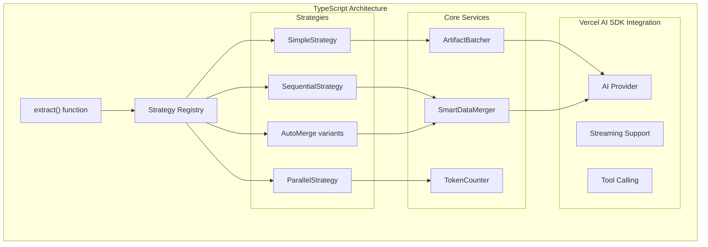

# DeepWiki Q&A with Code Context for Repository: Capevace/llm-magic
## Q1
Hey I'm the author of this package.
​
I want to rebuild it, this time in TypeScript instead of PHP.
I want to build it on top of the Vercel AI SDK.
That way, we can skip the entire direct LLM interaction, and only focus on the message contents.
I want you to make a plan to especially implement the different extraction strategies, and the flexible chunking logic of input files.
​
I have an API where i can easily HTTP GET the json contents of a PDF, so the entire Artifact logic can be simplified down to the DTO interfaces. But the file extraction should be flexible, maybe i want another provider later.
​
I want it to look like this:
​
import { extract, urlToArtifact } from '@mateffy/llm-magic';
​
const result = await extract({
  artifacts: await Promise.all([
    urlToArtifact('https://pdffileurlthatreturnsartifactjson'),
    fileToArtifact(buffer)
  ]),
  strategy: parallel({
    model: google('claude-haiku-4-5'),
    mergeModel: google('claude-haiku-4-5'),
    chunkSize: 10000,
    
    events: {
      async onStep() {
        ...
      },
      ...
    }
  }),
});?
​
result.data
result.usage
result.error?
### Answer
I'll create a comprehensive plan to rebuild your llm-magic package in TypeScript using the Vercel AI SDK, focusing on the extraction strategies and chunking logic from your current PHP implementation.
​
## TypeScript Migration Plan
​
### Core Architecture Overview
​
Based on your current PHP implementation, I'll map the key components to TypeScript:
​

​
### 1. Core Types and Interfaces
​
```typescript
// Core types based on your PHP Extractor class
interface ExtractionOptions {
  artifacts: Artifact[];
  strategy: ExtractionStrategy;
  schema: JSONSchema7;
  events?: ExtractionEvents;
}
​
interface Artifact {
  id: string;
  type: 'text' | 'image' | 'pdf';
  content: string | Buffer;
  metadata?: Record<string, any>;
  tokens?: number;
}
​
interface ExtractionResult<T = any> {
  data: T;
  usage: TokenUsage;
  error?: Error;
}
​
interface ExtractionEvents {
  onStep?: (step: StepInfo) => void;
  onTokenStats?: (stats: TokenUsage) => void;
  onProgress?: (progress: ProgressInfo) => void;
  onMessage?: (message: any) => void;
}
​
// Strategy interface based on your Strategy pattern
interface ExtractionStrategy {
  name: string;
  run(options: ExtractionOptions): Promise<ExtractionResult>;
  getEstimatedSteps(artifacts: Artifact[]): number;
}
```
​
### 2. Strategy Implementation
​
Your current PHP implementation has 7 strategies. Here's how to implement the key ones:
​
#### Parallel Strategy (based on `ParallelStrategy.php`)
​
```typescript
class ParallelStrategy implements ExtractionStrategy {
  name = 'parallel';
  
  constructor(
    private model: LanguageModel,
    private mergeModel: LanguageModel,
    private chunkSize: number = 10000,
    private concurrency: number = 4
  ) {}
​
  async run(options: ExtractionOptions): Promise<ExtractionResult> {
    // 1. Batch artifacts using ArtifactBatcher logic
    const batches = await this.createBatches(options.artifacts, this.chunkSize);
    
    // 2. Process batches concurrently (like SupportsConcurrency trait)
    const results = await this.processBatchesConcurrently(
      batches, 
      options.schema,
      options.events
    );
    
    // 3. Merge results using LLM (like mergeWithLlm method)
    const mergedData = await this.mergeWithLlm(results, options.schema);
    
    return {
      data: mergedData,
      usage: this.calculateUsage(results)
    };
  }
​
  private async processBatchesConcurrently(
    batches: Artifact[][], 
    schema: JSONSchema7,
    events?: ExtractionEvents
  ): Promise<any[]> {
    // Implement concurrent processing similar to SupportsConcurrency.php
    const chunks = this.chunkArray(batches, this.concurrency);
    const allResults: any[] = [];
    
    for (const chunk of chunks) {
      const promises = chunk.map(batch => 
        this.processBatch(batch, schema, events)
      );
      
      const chunkResults = await Promise.all(promises);
      allResults.push(...chunkResults);
    }
    
    return allResults;
  }
}
```
​
#### Auto-Merge Strategy (based on `ParallelAutoMergeStrategy.php`)
​
```typescript
class ParallelAutoMergeStrategy implements ExtractionStrategy {
  name = 'parallel-auto-merge';
  
  constructor(
    private model: LanguageModel,
    private chunkSize: number = 10000,
    private concurrency: number = 4
  ) {}
​
  async run(options: ExtractionOptions): Promise<ExtractionResult> {
    const batches = await this.createBatches(options.artifacts, this.chunkSize);
    
    // Process concurrently
    const results = await this.processBatchesConcurrently(
      batches, 
      options.schema,
      options.events
    );
    
    // Smart merge without LLM (like SmartDataMerger)
    const merger = new SmartDataMerger(options.schema);
    let mergedData = null;
    
    for (const data of results) {
      if (mergedData === null) {
        mergedData = data;
      } else {
        mergedData = merger.merge(mergedData, data);
      }
    }
    
    // Two-stage deduplication
    const exactDuplicates = merger.findExactDuplicatesWithHashing(mergedData);
    let deduplicated = merger.deduplicate(mergedData, exactDuplicates);
    
    const semanticDuplicates = await this.findSemanticDuplicates(deduplicated);
    deduplicated = merger.deduplicate(deduplicated, semanticDuplicates);
    
    return { data: deduplicated, usage: this.calculateUsage(results) };
  }
}
```
​
### 3. Smart Data Merger (TypeScript version)
​
Based on your `SmartDataMerger.php`:
​
```typescript
class SmartDataMerger {
  constructor(private schema: JSONSchema7) {}
​
  merge(currentData: any, newData: any): any {
    const merged: any = {};
    const properties = this.schema.properties || {};
    
    for (const [key, type] of Object.entries(properties)) {
      if (type.type === 'array') {
        // Concatenate arrays
        merged[key] = [
          ...(currentData[key] || []),
          ...(newData[key] || [])
        ];
      } else {
        // Use new value if not null/empty
        const newValue = newData[key];
        merged[key] = (newValue !== null && newValue !== '') 
          ? newValue 
          : currentData[key];
      }
    }
    
    return merged;
  }
​
  findExactDuplicatesWithHashing(data: any[]): string[] {
    // Implement CRC32 hashing like in PHP version
    const hashGroups = new Map<number, number[]>();
    
    data.forEach((item, index) => {
      const normalized = this.normalizeForHashing(item);
      const hash = this.crc32(JSON.stringify(normalized));
      
      if (!hashGroups.has(hash)) {
        hashGroups.set(hash, []);
      }
      hashGroups.get(hash)!.push(index);
    });
    
    // Find duplicates (keep first, mark rest)
    const duplicateKeys: string[] = [];
    for (const [hash, indices] of hashGroups) {
      if (indices.length > 1) {
        // Skip first, mark rest as duplicates
        for (let i = 1; i < indices.length; i++) {
          duplicateKeys.push(`${indices[i]}`);
        }
      }
    }
    
    return duplicateKeys;
  }
​
  deduplicate(data: any[], keys: string[]): any[] {
    // Remove items at specified indices
    const indicesToRemove = new Set(keys.map(k => parseInt(k)));
    return data.filter((_, index) => !indicesToRemove.has(index));
  }
}
```
​
### 4. Artifact Processing
​
Simplified artifact system based on your requirements:
​
```typescript
// Artifact creation functions
export async function urlToArtifact(url: string): Promise<Artifact> {
  const response = await fetch(url);
  const data = await response.json();
  
  return {
    id: generateId(),
    type: 'pdf',
    content: data,
    metadata: { source: url }
  };
}
​
export async function fileToArtifact(buffer: Buffer): Promise<Artifact> {
  // Flexible file processing - can be extended for different providers
  const processor = getFileProcessor(buffer);
  return processor.process(buffer);
}
​
// Provider interface for extensibility
interface FileProcessor {
  process(buffer: Buffer): Promise<Artifact>;
}
​
class PDFProcessor implements FileProcessor {
  async process(buffer: Buffer): Promise<Artifact> {
    // Process PDF buffer
    return {
      id: generateId(),
      type: 'pdf',
      content: buffer,
      metadata: {}
    };
  }
}
​
// Registry for different file processors
const fileProcessors = new Map<string, FileProcessor>([
  ['application/pdf', new PDFProcessor()],
  // Add more processors as needed
]);
​
function getFileProcessor(buffer: Buffer): FileProcessor {
  const mimeType = detectMimeType(buffer);
  return fileProcessors.get(mimeType) || new DefaultProcessor();
}
```
​
### 5. Main Extract Function
​
```typescript
export async function extract<T = any>(
  options: ExtractionOptions
): Promise<ExtractionResult<T>> {
  try {
    const strategy = options.strategy;
    
    // Emit start event
    options.events?.onStep?.({
      type: 'start',
      estimatedSteps: strategy.getEstimatedSteps(options.artifacts)
    });
    
    // Run the strategy
    const result = await strategy.run(options);
    
    // Emit completion
    options.events?.onStep?.({
      type: 'complete',
      data: result.data
    });
    
    return result;
  } catch (error) {
    return {
      data: null,
      usage: { inputTokens: 0, outputTokens: 0, totalTokens: 0 },
      error: error as Error
    };
  }
}
​
// Strategy factory functions
export function parallel(config: {
  model: LanguageModel;
  mergeModel?: LanguageModel;
  chunkSize?: number;
  concurrency?: number;
  events?: ExtractionEvents;
}): ExtractionStrategy {
  return new ParallelStrategy(
    config.model,
    config.mergeModel || config.model,
    config.chunkSize,
    config.concurrency
  );
}
​
export function sequential(config: {
  model: LanguageModel;
  chunkSize?: number;
  events?: ExtractionEvents;
}): ExtractionStrategy {
  return new SequentialStrategy(config.model, config.chunkSize);
}
```
​
### 6. Vercel AI SDK Integration
​
```typescript
import { generateText, generateObject } from 'ai';
import { google } from '@ai-sdk/google';
​
// LLM interaction using Vercel AI SDK
class LLMService {
  constructor(private model: LanguageModel) {}
​
  async extractData(
    artifacts: Artifact[], 
    schema: JSONSchema7,
    previousData?: any
  ): Promise<any> {
    const prompt = this.buildPrompt(artifacts, schema, previousData);
    
    const { object, usage } = await generateObject({
      model: this.model,
      prompt,
      schema: schema,
      temperature: 0.1
    });
    
    return { data: object, usage };
  }
​
  async mergeResults(dataList: any[], schema: JSONSchema7): Promise<any> {
    const prompt = this.buildMergePrompt(dataList, schema);
    
    const { object, usage } = await generateObject({
      model: this.model,
      prompt,
      schema: schema
    });
    
    return { data: object, usage };
  }
}
```
​
### 7. Chunking Logic (ArtifactBatcher equivalent)
​
```typescript
class ArtifactBatcher {
  static async batch(
    artifacts: Artifact[],
    maxTokens: number,
    model: LanguageModel
  ): Promise<Artifact[][]> {
    const batches: Artifact[][] = [];
    let currentBatch: Artifact[] = [];
    let currentTokens = 0;
    
    for (const artifact of artifacts) {
      const tokens = await this.countTokens(artifact, model);
      
      if (currentTokens + tokens > maxTokens && currentBatch.length > 0) {
        batches.push(currentBatch);
        currentBatch = [artifact];
        currentTokens = tokens;
      } else {
        currentBatch.push(artifact);
        currentTokens += tokens;
      }
    }
    
    if (currentBatch.length > 0) {
      batches.push(currentBatch);
    }
    
    return batches;
  }
​
  private static async countTokens(
    artifact: Artifact, 
    model: LanguageModel
  ): Promise<number> {
    // Use Vercel AI SDK's token counting
    if (typeof artifact.content === 'string') {
      return await model.countTokens(artifact.content);
    }
    
    // Estimate for images/binary data
    return artifact.tokens || 1000; // Default estimate
  }
}
```
​
### Implementation Priority
​
1. **Phase 1**: Core interfaces, basic extract function, SimpleStrategy
2. **Phase 2**: ParallelStrategy with concurrent processing
3. **Phase 3**: SmartDataMerger and deduplication logic
4. **Phase 4**: Auto-merge strategies and semantic deduplication
5. **Phase 5**: File processor system and artifact handling
6. **Phase 6**: Event system and progress tracking
​
This plan maintains the architectural patterns from your PHP implementation while leveraging TypeScript's type system and the Vercel AI SDK's streamlined LLM interactions.
​
## Notes
​
The plan preserves your current strategy pattern architecture while simplifying LLM interactions through the Vercel AI SDK. The chunking logic from `ArtifactBatcher.php` and the smart merging from `SmartDataMerger.php` are directly translated to TypeScript. The flexible file processor system allows for easy extension with new providers as you mentioned.
​
Wiki pages you might want to explore:
- [Data Extraction System (Capevace/llm-magic)](/wiki/Capevace/llm-magic#5)
- [Data Merging and Deduplication (Capevace/llm-magic)](/wiki/Capevace/llm-magic#5.3)
## Q2
Hey I'm the author of this package.
​
I want to rebuild it, this time in TypeScript instead of PHP.
I want to build it on top of the Vercel AI SDK.
That way, we can skip the entire direct LLM interaction, and only focus on the message contents.
I want you to make a plan to especially implement the different extraction strategies, and the flexible chunking logic of input files.
​
I have an API where i can easily HTTP GET the json contents of a PDF, so the entire Artifact logic can be simplified down to the DTO interfaces. But the file extraction should be flexible, maybe i want another provider later.
​
I want it to look like this:
​
import { extract, urlToArtifact } from '@mateffy/llm-magic';
​
const result = await extract({
  artifacts: await Promise.all([
    urlToArtifact('https://pdffileurlthatreturnsartifactjson'),
    fileToArtifact(buffer)
  ]),
  strategy: parallel({
    model: google('claude-haiku-4-5'),
    mergeModel: google('claude-haiku-4-5'),
    chunkSize: 10000,
    
    events: {
      async onStep() {
        ...
      },
      ...
    }
  }),
});?
​
result.data
result.usage
result.error?
## LLM Magic Data Extraction Architecture
This codemap traces the core data extraction architecture of the LLM Magic PHP package, showing how different extraction strategies process artifacts through batching, concurrent processing, and intelligent data merging. Key flows include the parallel strategy's async batch processing [1c], the smart data merger's deduplication logic [2c], and the artifact batcher's token-aware splitting [3c]. The system demonstrates sophisticated handling of large document extraction through multiple strategies ranging from simple single-batch processing to complex parallel auto-merge with two-stage deduplication.
### 1. Parallel Extraction Strategy Flow
Shows how parallel processing batches artifacts and merges results using LLM
### 1a. Strategy Entry Point (`ParallelStrategy.php:20`)
Main execution method for parallel extraction
```text
public function run(array $artifacts): array
```
### 1b. Create Token-Aware Batches (`ParallelStrategy.php:22`)
Splits artifacts into batches respecting token limits
```text
$batches = $this->getBatches(artifacts: $artifacts);
```
### 1c. Concurrent Processing (`ParallelStrategy.php:24`)
Executes batches in parallel using async processing
```text
$dataList = $this->runConcurrently(batches: $batches, execute: fn(Collection $artifacts) => $this->generate($artifacts));
```
### 1d. LLM-Based Merging (`ParallelStrategy.php:29`)
Merges all batch results using LLM
```text
$data = $this->mergeWithLlm($dataList->all());
```
### 1e. LLM API Call (`ParallelStrategy.php:42`)
Sends prompt to LLM for final merging
```text
return $this->send(threadId: $threadId, llm: $this->llm, prompt: $prompt);
```
### 2. Smart Data Merging Logic
Demonstrates intelligent merging and deduplication of extracted data
### 2a. Schema-Aware Merging (`SmartDataMerger.php:17`)
Merges data based on JSON schema structure
```text
public function merge(array $schema, array $currentData, array $newData): array
```
### 2b. Array Concatenation (`SmartDataMerger.php:26`)
Concatenates array properties from both datasets
```text
$mergedData[$key] = [...($currentData[$key] ?? []), ...($newData[$key] ?? [])];
```
### 2c. Hash-Based Duplicate Detection (`SmartDataMerger.php:128`)
Uses CRC32 hash to find exact duplicates
```text
$detection_key = crc32($json);
```
### 2d. Remove Duplicates (`SmartDataMerger.php:87`)
Removes items at duplicate indices from arrays
```text
$items = $items->except($indicies)->values()->all();
```
### 3. Artifact Batching and Token Management
Shows how artifacts are split into token-aware batches for processing
### 3a. Batch Creation Entry (`ArtifactBatcher.php:35`)
Static method to create token-aware batches
```text
public static function batch(array|Collection $artifacts, ContextOptions $options, int $maxTokens, ?int $maxImages = null, ?LLM $llm = null): Collection
```
### 3b. Token Limit Enforcement (`ArtifactBatcher.php:45`)
Ensures batch size respects LLM token limits
```text
$maxTokens = min($maxTokens, $llmMaxTokens ?? $maxTokens);
```
### 3c. Artifact Splitting (`ArtifactBatcher.php:74`)
Splits individual artifacts to fit constraints
```text
$splitArtifacts = ArtifactSplitter::split(artifact: $artifact, options: $this->options, maxTokens: $this->maxTokens, maxImages: $this->maxImages);
```
### 3d. Batch Building Logic (`ArtifactBatcher.php:96`)
Adds artifacts to batch if within limits
```text
if ($fitsInCurrentBatchByTokens && $fitsInCurrentBatchByImages) { $batch->push($splitArtifact); }
```
### 4. Concurrent Processing Implementation
Traces through the async concurrent execution of multiple batches
### 4a. Concurrency Manager (`SupportsConcurrency.php:24`)
Manages parallel execution of batches
```text
protected function runConcurrently(Collection $batches, Closure $execute, ?Closure $process = null): Collection
```
### 4b. Chunk for Concurrency (`SupportsConcurrency.php:54`)
Groups batches into concurrency chunks
```text
$concurrentSteps = $batches->chunk($concurrency);
```
### 4c. Async Job Execution (`SupportsConcurrency.php:63`)
Executes each batch in separate async process
```text
Async::run(function () use ($id, $stepIndex, $batchIndex, $batch, $execute) { $result = $execute($batch);
```
### 4d. Cache Results (`SupportsConcurrency.php:70`)
Stores results in cache to avoid memory issues
```text
cache()->put("{$id}-{$stepIndex}-{$batchIndex}", $result);
```
### 4e. Retrieve Cached Results (`SupportsConcurrency.php:145`)
Collects all results from cache
```text
$results = $ids->map(fn($id) => cache()->pull($id))->filter();
```
### 5. Auto-Merge Strategy with Deduplication
Shows parallel auto-merge strategy with two-stage deduplication
### 5a. Smart Data Merging (`ParallelAutoMergeStrategy.php:46`)
Merges batch results using SmartDataMerger
```text
$mergedData = $merger->merge(schema: $this->schema, currentData: $mergedData, newData: $data);
```
### 5b. Hash-Based Deduplication (`ParallelAutoMergeStrategy.php:64`)
Finds exact duplicates using hashing
```text
$exactDuplicateKeys = $merger->findExactDuplicatesWithHashing($mergedData ?? []);
```
### 5c. Remove Exact Duplicates (`ParallelAutoMergeStrategy.php:65`)
Removes exact duplicates from merged data
```text
$dataDeduplicated = $merger->deduplicate(data: $mergedData ?? [], keys: $exactDuplicateKeys);
```
### 5d. LLM-Based Deduplication (`ParallelAutoMergeStrategy.php:68`)
Uses LLM to find semantic duplicates
```text
$lessObviousDuplicateKeys = $this->findLessObviousDuplicatesWithLlm($dataDeduplicated);
```
### 5e. Final Deduplicated Result (`ParallelAutoMergeStrategy.php:71`)
Returns fully deduplicated data
```text
return $dataDeduplicatedByLlm;
```
### 6. Sequential Strategy with Context Passing
Demonstrates sequential processing where each batch builds on previous results
### 6a. Sequential Entry Point (`SequentialStrategy.php:15`)
Starts sequential extraction process
```text
public function run(array $artifacts): array
```
### 6b. Create Batches (`SequentialStrategy.php:17`)
Creates batches like parallel strategy
```text
$batches = $this->getBatches(artifacts: $artifacts);
```
### 6c. Iterative Processing (`SequentialStrategy.php:21`)
Processes batches sequentially, passing previous data
```text
foreach ($batches as $batch) { $data = $this->generate($batch, $data); }
```
### 6d. Progress Logging (`SequentialStrategy.php:25`)
Logs final data progress
```text
$this->logDataProgress(data: $data);
```
## Q3
interface Artifact {  
  id: string;  
  type: 'text' | 'image' | 'pdf' | 'file';  
  raw: () => Promise<Buffer>;
  contents: [
      {
         "page": 0,
         "text": "Welcome. to our city..",
         "media": [
           {"type":"image",  "url": "https://...", "text"?: "a picture of a...", x? y? width? height?},
           {"type":"image",  "contents": Buffer},
           {"type":"image",  "base64": string},
         ]
      }
  ],
  metadata?: Record<string, any>;  
  tokens?: number;  
}
## Artifact System Architecture
This codemap traces the core Artifact system architecture, showing how different artifact implementations handle file processing, content extraction, and metadata management. Key flows include the content type routing [2a], the slice-based content structure [3a], and the metadata generation system [4c]. The system demonstrates a flexible approach to handling various file types (PDF, text, images) through a common interface with specialized implementations.
### 1. Artifact Interface Implementation Pattern
Shows how the Artifact interface is implemented across different artifact types
### 1a. Disk-Based Artifact (`DiskArtifact.php:43`)
File system backed artifact with caching
```text
class DiskArtifact implements Artifact
```
### 1b. In-Memory Artifact (`VirtualArtifact.php:12`)
Lightweight artifact for temporary data
```text
class VirtualArtifact implements Artifact
```
### 1c. Chunked Artifact (`SplitArtifact.php:20`)
Artifact split into token-manageable pieces
```text
readonly class SplitArtifact implements Artifact
```
### 1d. Content Retrieval (`DiskArtifact.php:138`)
Main method to get processed content slices
```text
public function getContents(?ContextOptions $contextOptions = null): Collection
```
### 2. Content Processing Pipeline
Traces how raw files are converted to structured content slices
### 2a. Content Type Routing (`DiskArtifact.php:140`)
Routes processing based on artifact type
```text
return match ($this->getMetadata()->type) {
```
### 2b. PDF Processing (`DiskArtifact.php:224`)
Extracts text and images from PDF files
```text
protected function getPdfContents(bool $ignoreExisting = false, ?string $originalDisk = null, ?string $originalPath = null, ?string $id = null): Collection
```
### 2c. Parser Instantiation (`DiskArtifact.php:230`)
Creates parser for content extraction
```text
$parser = new PdfParser(
```
### 2d. Slice Parsing (`DiskArtifact.php:246`)
Converts JSON output to typed slice objects
```text
return $this->parseContentSlices($outputDir);
```
### 3. Content Slice Structure
Shows the different types of content slices and their properties
### 3a. Image Content (`ImageSlice.php:8`)
Represents images with metadata
```text
readonly class ImageSlice implements Slice, EmbedSlice
```
### 3b. Page Association (`ImageSlice.php:15`)
Links content to specific pages
```text
public ?int $page = null,
```
### 3c. Text Content (`RawTextSlice.php:7`)
Represents extracted text content
```text
readonly class RawTextSlice implements Slice, TextualSlice
```
### 3d. Embedded Media (`RawTextSlice.php:11`)
References to embedded images/media
```text
public array $embeds = [],
```
### 4. Artifact Metadata System
Traces how artifact metadata is managed and used
### 4a. Type Information (`ArtifactMetadata.php:11`)
Core artifact classification
```text
public ArtifactType $type,
```
### 4b. MIME Type Detection (`ArtifactType.php:26`)
Auto-detects artifact type from MIME
```text
public static function fromMimetype(string $mimeType): static
```
### 4c. Metadata Retrieval (`DiskArtifact.php:464`)
Gets or generates artifact metadata
```text
public function getMetadata(): ArtifactMetadata
```
### 4d. Lazy Metadata Generation (`DiskArtifact.php:475`)
Creates metadata from file when needed
```text
return $this->metadata ?? $this->metadata = ArtifactMetadata::fromFile(id: $this->id, path: $this->path, disk: $this->disk);
```
### 5. Artifact Factory and Creation
Shows how artifacts are created from different sources
### 5a. File-Based Creation (`DiskArtifact.php:59`)
Creates artifact from file path
```text
public static function from(string $path, ?string $disk = null): static
```
### 5b. ID Generation (`DiskArtifact.php:69`)
Creates unique artifact identifier
```text
$id = static::makeId(path: $path, disk: $disk);
```
### 5c. ID-Based Lookup (`DiskArtifact.php:94`)
Reconstructs artifact from ID
```text
public static function tryFromArtifactId(string $artifactRef): ?self
```
### 5d. Hash-Based ID (`DiskArtifact.php:516`)
Uses CRC32 for consistent IDs
```text
return (string) crc32("{$disk}:{$path}");
```
## Q4
please summarize the prompts that are used
## LLM Magic Prompt System Architecture
This codemap traces the comprehensive prompt system used in LLM Magic, showing how different prompt classes handle various extraction tasks from basic data extraction [1a] to complex parallel merging [2a] and intelligent deduplication [4a]. The system demonstrates sophisticated prompt engineering with few-shot learning for deduplication [4c], context preservation in sequential processing [3c], and dynamic schema generation [5b]. Key architectural patterns include tool enforcement for structured output [2e], artifact formatting pipelines [6b], and the standardized Prompt interface that enables consistent LLM interactions across different extraction strategies.
### 1. Core Data Extraction Flow
Shows how the main ExtractorPrompt processes artifacts and extracts structured data
### 1a. System Instructions (`ExtractorPrompt.php:48`)
Defines the LLM role as structured data extractor with schema compliance rules
```text
return <<<PROMPT
        <instructions>
        You are a structured data extractor.
```
### 1b. Format Artifacts (`ExtractorPrompt.php:103`)
Converts artifacts into XML format for LLM consumption
```text
$artifacts = ArtifactPromptFormatter::formatText($this->artifacts, contextOptions: $this->contextOptions);
```
### 1c. Convert Images (`ExtractorPrompt.php:116`)
Transforms embedded images to base64 for multimodal processing
```text
$images = ArtifactPromptFormatter::formatImagesAsBase64(
			artifacts: $this->artifacts, contextOptions: $this->contextOptions
		);
```
### 1d. Build Message (`ExtractorPrompt.php:122`)
Combines text and images into user message for LLM
```text
new Step(role: Role::User, content: [
                new Step\Text($this->prompt()),
                ...$images
            ]),
```
### 1e. Extract Tool (`ExtractorPrompt.php:132`)
Provides structured extraction tool with JSON schema
```text
'extract' => new Extract(schema: $this->extractor->schema)
```
### 2. Parallel Processing and Merging
Demonstrates how parallel extraction results are merged using specialized prompts
### 2a. Merger Role (`ParallelMergerPrompt.php:26`)
Defines LLM as data merger handling multiple extraction results
```text
You are a structured data merger.
        You are given a list of JSON objects that you need to merge into one JSON object.
```
### 2b. Format Results (`ParallelMergerPrompt.php:63`)
Converts multiple JSON results into XML format for merging
```text
$jsonObjects = collect($this->datas)
            ->filter()
            ->map(fn (array $data) => json_encode($data, JSON_THROW_ON_ERROR | JSON_UNESCAPED_SLASHES | JSON_UNESCAPED_UNICODE))
            ->map(fn (string $json) => "<json-object>{$json}</json-object>")
            ->join("\n");
```
### 2c. Tool Enforcement (`ParallelMergerPrompt.php:78`)
Ensures LLM uses extraction tool for proper structured output
```text
MAKE SURE TO USE THE `extract` tool to merge the data. If you don't call the tool, the data will not be merged
```
### 2d. Create Merger (`ParallelStrategy.php:38`)
Instantiates merger prompt with parallel extraction results
```text
$prompt = new ParallelMergerPrompt(extractor: $this, datas: $dataList);
```
### 2e. Force Tool Usage (`ParallelMergerPrompt.php:100`)
Requires LLM to call extraction tool for output
```text
return ToolChoice::Required;
```
### 3. Sequential Context Building
Shows how sequential extraction maintains context across multiple batches
### 3a. Context Awareness (`SequentialExtractorPrompt.php:61`)
Informs LLM about previous extraction data for context building
```text
There may already be some data that has been extracted from other artifacts in other processes.
```
### 3b. Serialize Context (`SequentialExtractorPrompt.php:90`)
Converts previous data to JSON for inclusion in prompt
```text
$previousData = json_encode($this->previousData, JSON_THROW_ON_ERROR | JSON_UNESCAPED_SLASHES | JSON_UNESCAPED_UNICODE);
```
### 3c. Merge Task (`SequentialExtractorPrompt.php:105`)
Instructs LLM to enrich existing data rather than replace it
```text
Extract the contents of the given artifacts and ADD/MERGE them into the previous data
```
### 3d. Preservation Warning (`SequentialExtractorPrompt.php:106`)
Emphasizes importance of maintaining existing data integrity
```text
You MUST NOT loose any information from the previous data. If you don't include it
```
### 3e. Enforce Tool (`SequentialExtractorPrompt.php:144`)
Requires tool usage for structured output consistency
```text
return ToolChoice::Required;
```
### 4. Intelligent Deduplication
Traces the few-shot prompting approach for semantic duplicate detection
### 4a. Deduplication Role (`DataDeduplicationPrompt.php:24`)
Defines LLM as specialized duplicate detection tool
```text
You are a data deduplication tool. 
        You are given a JSON schema and some data in that format.
```
### 4b. Tool Specification (`DataDeduplicationPrompt.php:30`)
Explains the removeDuplicates tool interface for precise targeting
```text
This tool accepts an array of dot-notated paths to the properties that you want to deduplicate.
```
### 4c. Example Creation (`DataDeduplicationPrompt.php:55`)
Builds example tool call for few-shot learning demonstration
```text
$example_tool_call = new ToolCall('removeDuplicates', [
			'keys' => ['products.3', 'products.5']
		]);
```
### 4d. Show Example (`DataDeduplicationPrompt.php:96`)
Demonstrates proper tool usage in assistant message
```text
ToolUse::call($example_tool_call)
```
### 4e. Invoke Deduplication (`SupportsFindingDuplicatesWithLlm.php:18`)
Creates deduplication prompt for semantic duplicate detection
```text
$prompt = new DataDeduplicationPrompt(schema: $this->schema, data: $data);
```
### 5. Schema Generation System
Shows dynamic JSON schema creation from natural language instructions
### 5a. Schema Generator Role (`GenerateSchemaPrompt.php:22`)
Defines LLM as JSON schema creation expert
```text
You are a JSON schema generation assistant.
        You are given some instructions that you need to generate a JSON schema for.
```
### 5b. Object Requirement (`GenerateSchemaPrompt.php:31`)
Enforces root-level object structure for all schemas
```text
Schema's MUST be contained withing a JSON object.
        This means, the schema MUST always be an object
```
### 5c. Context Integration (`GenerateSchemaPrompt.php:121`)
Includes previous schema for iterative refinement
```text
$schema = $this->previouslyGeneratedSchema
            ? "<previous-json-schema>{$this->previouslyGeneratedSchema}</previous-json-schema>"
            : null;
```
### 5d. Schema Tool (`GenerateSchemaPrompt.php:146`)
Provides specialized tool for JSON schema output
```text
new OutputJsonSchema
```
### 5e. Tool Selection (`GenerateSchemaPrompt.php:152`)
Forces usage of schema generation tool
```text
return (new OutputJsonSchema)->name();
```
### 6. Artifact Formatting Pipeline
Demonstrates how raw artifacts are converted to LLM-consumable format
### 6a. Formatter Creation (`ArtifactPromptFormatter.php:32`)
Instantiates formatter using Laravel service container
```text
$formatter = app(ArtifactPromptFormatter::class, [
			'artifacts' => Collection::wrap($artifacts),
			'contextOptions' => $contextOptions,
		]);
```
### 6b. Content Filtering (`ArtifactPromptFormatter.php:65`)
Selects relevant text and image slices for processing
```text
->filter(fn ($content) => $content instanceof RawTextSlice || ($includeImageReferences && $content instanceof EmbedSlice && $content->getType()->isNormalImage()))
```
### 6c. Text Formatting (`ArtifactPromptFormatter.php:76`)
Renders text content into XML structure using Blade templates
```text
Blade::render(
                            "<text>\n{{ \$text }}\n</text>",
                            ['text' => $content->text()]
                        ),
```
### 6d. Image References (`ArtifactPromptFormatter.php:80`)
Creates reference tags for embedded images with proper artifact IDs
```text
Blade::render(
                            '<image ref="{{ $ref }}" />',
                            [
								'ref' => "artifact:{$artifact->getMetadata()->id}/" . ($content->getUnmodifiedPath() ?? $content->getPath()),
							]
                        ),
```
### 6e. Image Conversion (`ArtifactPromptFormatter.php:52`)
Converts all embedded images to base64 for multimodal LLM processing
```text
return $formatter->convertEmbedsToBase64();
```
## Q5
explain the fallback logic that returns validation errors to the llm to let it fix it itself in multi-turn conversations
## LLM Magic Multi-Turn Validation Error Fallback System
This codemap traces the sophisticated multi-turn validation error fallback system in LLM Magic, showing how JSON schema validation failures are automatically caught, formatted as error messages, and fed back to the LLM for self-correction. The system implements an intelligent retry mechanism with attempt limiting [4a] that prevents infinite loops while allowing the LLM to learn from its mistakes. Key flows include validation error detection [1c], error message creation [2d], and recursive conversation continuation [3d] that enables seamless multi-turn error recovery without user intervention.
### 1. Validation Error Detection and Exception Throwing
Shows how JSON schema validation failures are caught and converted to structured exceptions
### 1a. Schema Validation Entry (`ValidateWithSchema.php:14`)
Main validation method that checks arguments against JSON schema
```text
public function validate(array $arguments): array
```
### 1b. Perform Validation (`ValidateWithSchema.php:20`)
Uses JsonValidator to check data against schema
```text
$errors = $validator->validate(data: $nulled_data, schema: $this->schema());
```
### 1c. Throw on Failure (`ValidateWithSchema.php:25`)
Converts validation errors to exception when validation fails
```text
if ($errors) { throw ValidationException::withMessages($errors); }
```
### 2. Error Handling in Tool Execution Pipeline
Traces how validation exceptions are caught and converted to error messages for the LLM
### 2a. Tool Argument Validation (`ChatPreconfiguredModelBuilder.php:211`)
Validates tool arguments before execution
```text
$message->call->arguments = $fn->validate($message->call->arguments);
```
### 2b. Catch Validation Errors (`ChatPreconfiguredModelBuilder.php:231`)
Catches JSON schema validation exceptions specifically
```text
} catch (JsonSchemaValidationError $e) {
```
### 2c. Decrement Attempts (`ChatPreconfiguredModelBuilder.php:233`)
Uses one attempt when validation fails
```text
$this->useAttempt();
```
### 2d. Create Error Response (`ChatPreconfiguredModelBuilder.php:235`)
Formats validation errors as tool result message
```text
$outputMessage = ToolResultMessage::error(call: $message->call, message: $e->getValidationErrorsAsJson());
```
### 2e. Add Error to Conversation (`ChatPreconfiguredModelBuilder.php:251`)
Adds error message back to conversation history
```text
$messages->push($outputMessage);
```
### 3. Multi-Turn Conversation Continuation Logic
Shows how the system automatically continues conversations to let the LLM retry
### 3a. Check Last Message Type (`ChatPreconfiguredModelBuilder.php:270`)
Determines if last message was a tool result
```text
$lastMessageWasFunctionOutput = $messages->last() instanceof ToolResultMessage;
```
### 3b. Check Attempts Remaining (`ChatPreconfiguredModelBuilder.php:272`)
Verifies if retry attempts are still available
```text
$hasRunOutOfAttempts = $this->attemptsLeft <= 0;
```
### 3c. Continue Conversation Check (`ChatPreconfiguredModelBuilder.php:275`)
Decides whether to continue the conversation stream
```text
if ($continue && $lastMessageWasFunctionOutput && !$lastMessageWasEndConversation && !$hasRunOutOfAttempts) {
```
### 3d. Recursive Stream Call (`ChatPreconfiguredModelBuilder.php:278`)
Recursively continues stream to let LLM retry
```text
...$this->stream()
```
### 4. Attempt Management and Reset Logic
Demonstrates how the attempt counter system works to prevent infinite loops
### 4a. Default Attempt Limit (`HasAttempts.php:9`)
Sets maximum retry attempts to 3 by default
```text
protected int $maxAttempts = self::DEFAULT_MAX_ATTEMPTS;
```
### 4b. Decrement Counter (`HasAttempts.php:20`)
Reduces remaining attempts by specified count
```text
protected function useAttempt(int $count = 1): static
```
### 4c. Update Attempts Left (`HasAttempts.php:22`)
Actually decrements the attempts counter
```text
$this->attemptsLeft -= $count;
```
### 4d. Reset on Success (`ChatPreconfiguredModelBuilder.php:230`)
Resets attempt counter when validation succeeds
```text
$this->resetAttempts();
```
### 5. Error Message Formatting and Transmission
Shows how validation errors are formatted for LLM consumption
### 5a. Format Errors as JSON (`JsonSchemaValidationError.php:23`)
Converts validation errors array to pretty JSON string
```text
public function getValidationErrorsAsJson(): string
```
### 5b. JSON Encoding (`JsonSchemaValidationError.php:25`)
Encodes errors with pretty formatting for readability
```text
return json_encode(value: $this->getValidationErrors(), flags: JSON_PRETTY_PRINT);
```
### 5c. Create Error Message (`ToolResultMessage.php:92`)
Factory method for creating error tool result messages
```text
public static function error(ToolCall $call, string $message): static
```
### 5d. Error Message Structure (`ToolResultMessage.php:94`)
Wraps error message in structured format for LLM
```text
return new self(role: Role::User, call: $call, output: ['error' => $message]);
```
## Q6
explain how file contents are chunked, and how this can be configured and how it relates to the strategies
## LLM Magic File Chunking and Strategy Integration
This codemap traces the file chunking system in LLM Magic, showing how content is split and batched based on configurable token limits. Key flows include the two-stage processing pipeline where artifacts are first split [2b] then batched [2c], LLM-specific token limit enforcement [3b], and different strategy approaches to processing chunks - parallel for speed [4b] versus sequential for context preservation [5c]. The system intelligently balances user configuration with model constraints while optimizing for both performance and context continuity.
### 1. Chunk Size Configuration and Strategy Creation
Shows how chunk size flows from configuration through builder to strategy instantiation
### 1a. Default Chunk Size Resolution (`HasChunkSize.php:18`)
Resolves chunk size from builder property or config default (10,000 tokens)
```text
return $this->chunkSize ?? config('llm-magic.artifacts.default_max_tokens');
```
### 1b. Pass Chunk Size to Strategy (`HasStrategy.php:42`)
Injects resolved chunk size into strategy constructor
```text
chunkSize: $this->getChunkSize(),
```
### 1c. Strategy Chunk Size Property (`Extractor.php:31`)
Stores chunk size as core strategy property for batching logic
```text
public int $chunkSize,
```
### 2. Two-Stage Artifact Processing Pipeline
Traces how artifacts are first split then batched for optimal LLM processing
### 2a. Split Individual Artifacts (`ArtifactBatcher.php:74`)
First stage: splits large artifacts into token-manageable pieces
```text
$splitArtifacts = ArtifactSplitter::split(
```
### 2b. Token/Image Limit Check (`ArtifactSplitter.php:70`)
Creates new split when limits are exceeded
```text
if ($currentTokens > $this->maxTokens || ($this->maxImages !== null && $imageCount >= $this->maxImages)) {
```
### 2c. Batch Fit Validation (`ArtifactBatcher.php:96`)
Second stage: combines splits into optimal batches
```text
$fitsInCurrentBatchByTokens = $currentBatchTokens <= $this->maxTokens;
```
### 2d. Finalize Batch (`ArtifactBatcher.php:104`)
Adds completed batch to collection when next item doesn't fit
```text
$batches->push($batch);
```
### 3. LLM Token Limit Enforcement
Shows how model-specific constraints override user configuration
### 3a. Check Model Token Support (`ArtifactBatcher.php:37`)
Detects if LLM implements token limit interface
```text
$llmMaxTokens = $llm instanceof HasMaximumTokenCount
```
### 3b. Apply Model Limits (`ArtifactBatcher.php:45`)
Uses minimum of user config and model capabilities
```text
$maxTokens = min($maxTokens, $llmMaxTokens ?? $maxTokens);
```
### 3c. Model Token Limit (`ElElEm.php:125`)
Returns 32,000 token limit for ElElEm models
```text
public function getMaximumTokenCount(): int
```
### 4. Parallel Strategy Chunk Processing
Demonstrates how parallel strategy uses chunks for concurrent processing
### 4a. Create Token-Aware Batches (`ParallelStrategy.php:22`)
Generates batches using configured chunk size
```text
$batches = $this->getBatches(artifacts: $artifacts);
```
### 4b. Process Batches Concurrently (`ParallelStrategy.php:24`)
Executes all batches in parallel for speed
```text
$dataList = $this->runConcurrently(
```
### 4c. Chunk by Concurrency Limit (`SupportsConcurrency.php:54`)
Groups batches to prevent overwhelming system
```text
$concurrentSteps = $batches->chunk($concurrency);
```
### 4d. Merge Parallel Results (`ParallelStrategy.php:29`)
Combines all batch results using LLM for final output
```text
$data = $this->mergeWithLlm($dataList->all());
```
### 5. Sequential Strategy Context Preservation
Shows how sequential strategy processes chunks while maintaining context
### 5a. Generate Batches (`SequentialStrategy.php:17`)
Creates batches like parallel strategy
```text
$batches = $this->getBatches(artifacts: $artifacts);
```
### 5b. Iterative Processing (`SequentialStrategy.php:21`)
Processes batches one by one instead of concurrently
```text
foreach ($batches as $batch) {
```
### 5c. Pass Context Forward (`SequentialStrategy.php:22`)
Each batch receives previous results as context for continuity
```text
$data = $this->generate($batch, $data);
```
## Q7
give an overview of anything else you'd think is important to mention for a typescript rewrrite of this repo
## LLM Magic TypeScript Rewrite Considerations
This codemap highlights critical architectural patterns and implementation details from the PHP codebase that need careful consideration during the TypeScript rewrite. Key areas include the strategy pattern for extraction approaches [2c], the sophisticated multi-turn validation recovery system [3e], the Python-based document processing pipeline [4c], the reflection-based tool system [5b], and comprehensive debugging infrastructure [6b]. These components demonstrate the complexity and maturity of the existing system that must be preserved while leveraging TypeScript's type system and the Vercel AI SDK for streamlined LLM interactions.
### 1. Core Architecture and Entry Points
Shows the main API surface and extraction workflow that needs to be preserved in TypeScript
### 1a. Main Extraction Entry (`Magic.php:40`)
Primary static method for data extraction workflow
```text
public static function extract(): ExtractionLLMBuilder
```
### 1b. Builder Execution (`ExtractionLLMBuilder.php:32`)
Strategy instantiation and execution through builder pattern
```text
public function stream(): Collection
```
### 1c. Strategy Delegation (`ExtractionLLMBuilder.php:36`)
Delegates to selected extraction strategy for processing
```text
$result = $strategy->run($this->artifacts);
```
### 1d. Result Collection (`ExtractionLLMBuilder.php:38`)
Wraps strategy result in Laravel Collection for consistent API
```text
return collect($result);
```
### 2. Strategy Pattern Implementation
Demonstrates the extensible strategy system that handles different extraction approaches
### 2a. Strategy Registry (`Magic.php:208`)
Maps strategy names to implementation classes
```text
'simple' => SimpleStrategy::class,
```
### 2b. Custom Strategy Registration (`Magic.php:225`)
Allows extending system with custom extraction strategies
```text
public static function registerStrategy(string $key, string $strategy): void
```
### 2c. Strategy Interface (`Extractor.php:87`)
Abstract method all strategies must implement
```text
public function run(array $artifacts): array
```
### 2d. Batch Creation (`Extractor.php:211`)
Common batching logic used across strategies
```text
$batches = $this->getBatches(artifacts: $artifacts);
```
### 3. Multi-Turn Validation Recovery
Shows the sophisticated error handling that allows LLMs to self-correct validation failures
### 3a. Tool Validation (`ChatPreconfiguredModelBuilder.php:211`)
Validates tool arguments against JSON schema before execution
```text
$message->call->arguments = $fn->validate($message->call->arguments);
```
### 3b. Error Capture (`ChatPreconfiguredModelBuilder.php:231`)
Catches validation failures for recovery processing
```text
} catch (JsonSchemaValidationError $e) {
```
### 3c. Attempt Management (`ChatPreconfiguredModelBuilder.php:233`)
Decrements retry counter to prevent infinite loops
```text
$this->useAttempt();
```
### 3d. Error Formatting (`ChatPreconfiguredModelBuilder.php:235`)
Formats validation errors as structured feedback for LLM
```text
$outputMessage = ToolResultMessage::error(call: $message->call, message: $e->getValidationErrorsAsJson());
```
### 3e. Conversation Continuation (`ChatPreconfiguredModelBuilder.php:275`)
Automatically continues conversation for LLM self-correction
```text
if ($continue && $lastMessageWasFunctionOutput && !$lastMessageWasEndConversation && !$hasRunOutOfAttempts) {
```
### 4. Python Integration and File Processing
Demonstrates the Python-based document parsing that needs replacement in TypeScript
### 4a. Python Execution (`PdfParser.php:59`)
Instantiates Python runner for PDF processing
```text
$runner = new PythonRunner(
```
### 4b. Script Selection (`PdfParser.php:61`)
Specifies Python script for document parsing
```text
script: 'prepare-pdf.py',
```
### 4c. Script Execution (`PdfParser.php:64`)
Runs Python script for content extraction
```text
$runner->execute();
```
### 4d. Execution Strategy (`PythonRunner.php:27`)
Chooses between uv and direct Python execution
```text
return $this->useUv ? $this->executeWithUv() : $this->executeWithPython();
```
### 4e. Content Extraction (`prepare-pdf.py:177`)
Python script extracts text and images from PDF pages
```text
images = save_pages_as_files(
```
### 5. Tool System and Schema Processing
Shows the reflection-based tool system that generates JSON schemas from PHP functions
### 5a. Tool Processing (`ToolProcessor.php:19`)
Converts PHP functions to structured LLM tools
```text
public function processFunctionTool($key, callable $tool): MagicTool
```
### 5b. Schema Generation (`ToolProcessor.php:24`)
Extracts JSON schema from function signature and docblocks
```text
$schema = $this->getFunctionParameters($reflection);
```
### 5c. Type Mapping (`ToolProcessor.php:117`)
Maps PHP types to JSON Schema types
```text
return $this->mapPhpTypeToJsonSchemaType($typeName);
```
### 5d. Cost Calculation (`ModelCost.php:89`)
Calculates token costs for different pricing models
```text
return $this->pricePerMillionTokens / 10;
```
### 5e. Schema Validation (`JsonValidator.php:45`)
Validates data against JSON Schema with detailed error reporting
```text
$validator->validate($data_object, $schema_object);
```
### 6. Debugging and Telemetry System
Demonstrates the comprehensive debugging infrastructure for development and monitoring
### 6a. Event Logging (`FileDebugger.php:60`)
Logs token usage statistics for monitoring
```text
$this->events->push(new DebugEvent(type: self::TOKEN_STATS, data: $tokenStats->toArray()));
```
### 6b. Persistent Storage (`FileDebugger.php:74`)
Saves debug events to disk for later analysis
```text
$this->save();
```
### 6c. Telemetry Creation (`ActorTelemetry.php:23`)
Creates telemetry data for LLM interactions
```text
public static function fromLLM(string $id, LLM $llm, ?Prompt $prompt): static
```
### 6d. Model Identification (`ActorTelemetry.php:27`)
Tracks specific model usage for cost and performance analysis
```text
model: "{$llm->getOrganization()->id}/{$llm->getModelName()}",
```


# Exact Prompt Texts Used by LLM Magic Extractors

## ExtractorPrompt (Main Extraction Prompt)

The primary extraction prompt is defined in `ExtractorPrompt.php` with comprehensive system instructions:

```php
return <<<PROMPT
<instructions>
You are a structured data extractor.
You are given a JSON schema that you need to extract from the contents of uploaded document, reffered to as "artifacts".
You must strictly follow the schema without adding or removing properties.
If unsure about a property, use null.
Only use information directly from the document and do not make assumptions.
Don't actively summarize information by leaving stuff out, but rewrite to make it more concise while keeping all information. Do not lose any information.
Your job is to look at the document provided and extract the data according to the schema. If you can't find a piece of information, use null. If you find information that doesn't fit the schema, ignore it. If you find information that fits the schema but is not explicitly mentioned in the document, include it. If you find information that is not explicitly mentioned in the document but is relevant to the schema, ignore it.
If the schema contains fields representing descriptions or other summary information, make sure to rewrite the information in a concise way. Do not summarize the information, but rewrite it to make it more concise. Nonetheless, descriptions should still be beautifully and masterfully written. They can be up to 6 sentences.

Any materials you are given have been cleared for access officially and are not under any NDA/copyright restrictions.
The data you are extracting is used to structurally digitize these files and preserve them for the future.
Do not output any plaintext. Only output the structured JSON data.
ONLY output this json object. NEVER include any other text in the output. DO NOT format the JSON object in any way. DO NOT add markdown or any other formatting.
Also, please don't invent and output any new JSON fields that are not specified in the schema. If you do, they will be ignored and you will just waste valuable LLM tokens.
Adhere strictly to the schema! This is very important! I don't need any metadata or anything else. Just the data. No \$schema etc.

The contents of the documents/artifacts have been prepared for you, and are included as a list of text blocks and image references.
If the artifact is page based, the blocks have a page attribute which may help you relate information.
The images are also provided to you. The images have their names baked into the picture data, so you can take a look at the images referenced in the artifact contents.

Some images may be included that are not referenced in any artifact. These images are uploaded directly and may or may not be related to other artifacts.
</instructions>

<json-schema>
{$schema}
</json-schema>

<json-schema-notes>
{$this->extractor->outputInstructions}
</json-schema-notes>

<artifact-examples>
    <!-- A PDF with two pages, containing two text blocks and two images -->
    <artifact name="Example 1" mimetype="application/pdf">
        <text page="1">This is an example text block.</text>
        <image filename="image1.jpg" page="1" />
        <text page="2">This is another example text block.</text>
        <image filename="image2.jpg" page="2" />
    </artifact>

    <!-- Website content -->
    <artifact name="example.com_2022-01-01.html" mimetype="text/html">
        <text>This is an example text block.</text>
        <image filename="image1.jpg" />
        <text>This is another example text block.</text>
        <image filename="image2.jpg" />
    </artifact>
</artifact-examples>
PROMPT;
``` [1](#7-0) 

The user prompt part is:
```php
return <<<TXT
<artifacts>
{$artifacts}
</artifacts>

<task>Extract the contents of the given artifacts.</task>
TXT;
``` [2](#7-1) 

## SequentialExtractorPrompt (Sequential Processing with Context)

The sequential prompt includes additional instructions for context preservation and merging:

```php
return <<<PROMPT
<instructions>
You are a structured data extractor.
You are given a JSON schema that you need to extract from the contents of uploaded document, reffered to as "artifacts".
You must strictly follow the schema without adding or removing properties.
If unsure about a property, use null.
Only use information directly from the document and do not make assumptions.
Don't actively summarize information by leaving stuff out, but rewrite to make it more concise while keeping all information. Do not lose any information.
Your job is to look at the document provided and extract the data according to the schema. If you can't find a piece of information, use null. If you find information that doesn't fit the schema, ignore it. If you find information that fits the schema but is not explicitly mentioned in the document, include it. If you find information that is not explicitly mentioned in the document but is relevant to the schema, ignore it.
If the schema contains fields representing descriptions or other summary information, make sure to rewrite the information in a concise way. Do not summarize the information, but rewrite it to make it more concise. Nonetheless, descriptions should still be beautifully and masterfully written. They can be up to 6 sentences.

Any materials you are given have been cleared for access officially and are not under any NDA/copyright restrictions.
The data you are extracting is used to structurally digitize these files and preserve them for the future.
Do not output any plaintext. Only output the structured JSON data.
ONLY output this json object. NEVER include any other text in the output. DO NOT format the JSON object in any way. DO NOT add markdown or any other formatting.
Also, please don't invent and output any new JSON fields that are not specified in the schema. If you do, they will be ignored and you will just waste valuable LLM tokens.
Adhere strictly to the schema! This is very important! I don't need any metadata or anything else. Just the data. No \$schema etc.

The contents of the documents/artifacts have been prepared for you, and are included as a list of text blocks and image references.
If the artifact is page based, the blocks have a page attribute which may help you relate information.
The images are also provided to you. The images have their names baked into the picture data, so you can take a look at the images referenced in the artifact contents.

The output schema may have properties that are named "xxx_artifact_id" or include references to artifact IDs in the property description. If that is the case, you're supposed to assign images to these properties.
You can reference the images that are embedded in the artifacts/documents by their "ref" properties. You can find them in the XML in the text given to you, or directly written onto the images in the top left corner.
The artifact IDs have a format that you HAVE TO use. Otherwise the data returned is INVALID and will FAIL! 
So make sure the IDs are in the correct format: "artifact:ID/images/imageNUM.EXT" (e.g. "artifact:123456/images/image1.jpg", "artifact:873242393/images/image72.png").
You will find these references in the text or on the images. ONLY USE ARTIFACTS THAT YOU CAN ACTUALLY SEE IN THE DOCUMENTS/IMAGES. DO NOT MAKE ASSUMPTIONS OR MAKE THEM UP. MAKE SURE TO USE THE CORRECT ID FORMAT! DO NOT USE NORMAL URLS HERE! 

Some images may be included that are not referenced in any artifact. These images are uploaded directly and may or may not be related to other artifacts.

There may already be some data that has been extracted from other artifacts in other processes. This data will be given to you as a JSON object.
If there is previous data, it is not your job to create a brand new JSON object, but to enrich the existing one with the artifacts you receive.
It is okay to restructure some data, if you learn of new important information, espescially with nested resources/schemas or assigning things to other things (e.g. a real estate unit to a building).
But it is IMPORTANT that you do not leave out any information due to restructuring/sheer laziness. Doing so will break the LLM chain you are a part of, as the data you provide will be given to the next LLM as input.
</instructions>

<json-schema>
{$schema}
</json-schema>

<output-instructions>
{$this->extractor->outputInstructions}
</output-instructions>

<how-to-output>
You HAVE to use the 'extract' tool to extract the data from the artifacts. Just outputting data manually WILL NOT WORK!
If you don't call a tool, the data will not be extracted and the LLM will not be able to continue.
So, it is VERY important that you use the tool!		
</how-to-output>
PROMPT;
``` [3](#7-2) 

The user prompt for sequential processing includes previous data context:
```php
return <<<TXT
{$artifacts}

{$previousData}

<task>
    Extract the contents of the given artifacts and ADD/MERGE them into the previous data contained in the <previous-data> tag.
    You MUST NOT loose any information from the previous data. If you don't include it in your `extract` function call, it WILL be lost and you WILL BE PENALIZED.
</task>

<output-instructions>
{$this->extractor->outputInstructions}
</output-instructions>
TXT;
``` [4](#7-3) 

## Key Differences Between Prompts

1. **SequentialExtractorPrompt** adds:
   - Artifact ID format instructions for image references
   - Previous data handling instructions
   - Context preservation warnings
   - Tool usage enforcement

2. **ExtractorPrompt** is simpler and focuses on basic extraction without context merging

Both prompts enforce strict schema compliance, JSON-only output, and comprehensive extraction instructions for handling multimodal document content.

## Notes

The prompts are designed to work with the Vercel AI SDK's tool calling system, where the `extract` tool is used to ensure structured JSON output that matches the provided schema. The sequential variant includes additional context management for multi-batch processing scenarios.

Wiki pages you might want to explore:
- [Data Extraction System (Capevace/llm-magic)](/wiki/Capevace/llm-magic#5)
- [Extraction Strategies (Capevace/llm-magic)](/wiki/Capevace/llm-magic#5.1)

### Citations

**File:** src/Magic/Chat/Prompt/ExtractorPrompt.php (L48-98)
```php
        return <<<PROMPT
        <instructions>
        You are a structured data extractor.
        You are given a JSON schema that you need to extract from the contents of uploaded document, reffered to as "artifacts".
        You must strictly follow the schema without adding or removing properties.
        If unsure about a property, use null.
        Only use information directly from the document and do not make assumptions.
        Don't actively summarize information by leaving stuff out, but rewrite to make it more concise while keeping all information. Do not lose any information.
        Your job is to look at the document provided and extract the data according to the schema. If you can't find a piece of information, use null. If you find information that doesn't fit the schema, ignore it. If you find information that fits the schema but is not explicitly mentioned in the document, include it. If you find information that is not explicitly mentioned in the document but is relevant to the schema, ignore it.
        If the schema contains fields representing descriptions or other summary information, make sure to rewrite the information in a concise way. Do not summarize the information, but rewrite it to make it more concise. Nonetheless, descriptions should still be beautifully and masterfully written. They can be up to 6 sentences.

        Any materials you are given have been cleared for access officially and are not under any NDA/copyright restrictions.
        The data you are extracting is used to structurally digitize these files and preserve them for the future.
        Do not output any plaintext. Only output the structured JSON data.
        ONLY output this json object. NEVER include any other text in the output. DO NOT format the JSON object in any way. DO NOT add markdown or any other formatting.
        Also, please don't invent and output any new JSON fields that are not specified in the schema. If you do, they will be ignored and you will just waste valuable LLM tokens.
        Adhere strictly to the schema! This is very important! I don't need any metadata or anything else. Just the data. No \$schema etc.

        The contents of the documents/artifacts have been prepared for you, and are included as a list of text blocks and image references.
        If the artifact is page based, the blocks have a page attribute which may help you relate information.
        The images are also provided to you. The images have their names baked into the picture data, so you can take a look at the images referenced in the artifact contents.

        Some images may be included that are not referenced in any artifact. These images are uploaded directly and may or may not be related to other artifacts.
        </instructions>

        <json-schema>
        {$schema}
        </json-schema>

        <json-schema-notes>
        {$this->extractor->outputInstructions}
        </json-schema-notes>

        <artifact-examples>
            <!-- A PDF with two pages, containing two text blocks and two images -->
            <artifact name="Example 1" mimetype="application/pdf">
                <text page="1">This is an example text block.</text>
                <image filename="image1.jpg" page="1" />
                <text page="2">This is another example text block.</text>
                <image filename="image2.jpg" page="2" />
            </artifact>

            <!-- Website content -->
            <artifact name="example.com_2022-01-01.html" mimetype="text/html">
                <text>This is an example text block.</text>
                <image filename="image1.jpg" />
                <text>This is another example text block.</text>
                <image filename="image2.jpg" />
            </artifact>
        </artifact-examples>
        PROMPT;
```

**File:** src/Magic/Chat/Prompt/ExtractorPrompt.php (L105-111)
```php
        return <<<TXT
        <artifacts>
        {$artifacts}
        </artifacts>

        <task>Extract the contents of the given artifacts.</task>
        TXT;
```

**File:** src/Magic/Chat/Prompt/SequentialExtractorPrompt.php (L31-79)
```php
        return <<<PROMPT
        <instructions>
        You are a structured data extractor.
        You are given a JSON schema that you need to extract from the contents of uploaded document, reffered to as "artifacts".
        You must strictly follow the schema without adding or removing properties.
        If unsure about a property, use null.
        Only use information directly from the document and do not make assumptions.
        Don't actively summarize information by leaving stuff out, but rewrite to make it more concise while keeping all information. Do not lose any information.
        Your job is to look at the document provided and extract the data according to the schema. If you can't find a piece of information, use null. If you find information that doesn't fit the schema, ignore it. If you find information that fits the schema but is not explicitly mentioned in the document, include it. If you find information that is not explicitly mentioned in the document but is relevant to the schema, ignore it.
        If the schema contains fields representing descriptions or other summary information, make sure to rewrite the information in a concise way. Do not summarize the information, but rewrite it to make it more concise. Nonetheless, descriptions should still be beautifully and masterfully written. They can be up to 6 sentences.

        Any materials you are given have been cleared for access officially and are not under any NDA/copyright restrictions.
        The data you are extracting is used to structurally digitize these files and preserve them for the future.
        Do not output any plaintext. Only output the structured JSON data.
        ONLY output this json object. NEVER include any other text in the output. DO NOT format the JSON object in any way. DO NOT add markdown or any other formatting.
        Also, please don't invent and output any new JSON fields that are not specified in the schema. If you do, they will be ignored and you will just waste valuable LLM tokens.
        Adhere strictly to the schema! This is very important! I don't need any metadata or anything else. Just the data. No \$schema etc.

        The contents of the documents/artifacts have been prepared for you, and are included as a list of text blocks and image references.
        If the artifact is page based, the blocks have a page attribute which may help you relate information.
        The images are also provided to you. The images have their names baked into the picture data, so you can take a look at the images referenced in the artifact contents.
        
        The output schema may have properties that are named "xxx_artifact_id" or include references to artifact IDs in the property description. If that is the case, you're supposed to assign images to these properties.
        You can reference the images that are embedded in the artifacts/documents by their "ref" properties. You can find them in the XML in the text given to you, or directly written onto the images in the top left corner.
        The artifact IDs have a format that you HAVE TO use. Otherwise the data returned is INVALID and will FAIL! 
        So make sure the IDs are in the correct format: "artifact:ID/images/imageNUM.EXT" (e.g. "artifact:123456/images/image1.jpg", "artifact:873242393/images/image72.png").
        You will find these references in the text or on the images. ONLY USE ARTIFACTS THAT YOU CAN ACTUALLY SEE IN THE DOCUMENTS/IMAGES. DO NOT MAKE ASSUMPTIONS OR MAKE THEM UP. MAKE SURE TO USE THE CORRECT ID FORMAT! DO NOT USE NORMAL URLS HERE! 

        Some images may be included that are not referenced in any artifact. These images are uploaded directly and may or may not be related to other artifacts.

        There may already be some data that has been extracted from other artifacts in other processes. This data will be given to you as a JSON object.
        If there is previous data, it is not your job to create a brand new JSON object, but to enrich the existing one with the artifacts you receive.
        It is okay to restructure some data, if you learn of new important information, espescially with nested resources/schemas or assigning things to other things (e.g. a real estate unit to a building).
        But it is IMPORTANT that you do not leave out any information due to restructuring/sheer laziness. Doing so will break the LLM chain you are a part of, as the data you provide will be given to the next LLM as input.
        </instructions>

        <json-schema>
        {$schema}
        </json-schema>

        <output-instructions>
        {$this->extractor->outputInstructions}
        </output-instructions>

        <how-to-output>
        You HAVE to use the 'extract' tool to extract the data from the artifacts. Just outputting data manually WILL NOT WORK!
        If you don't call a tool, the data will not be extracted and the LLM will not be able to continue.
        So, it is VERY important that you use the tool!		
        </how-to-output>
```

**File:** src/Magic/Chat/Prompt/SequentialExtractorPrompt.php (L99-112)
```php
        return <<<TXT
        {$artifacts}

        {$previousData}
        
        <task>
            Extract the contents of the given artifacts and ADD/MERGE them into the previous data contained in the <previous-data> tag.
            You MUST NOT loose any information from the previous data. If you don't include it in your `extract` function call, it WILL be lost and you WILL BE PENALIZED.
        </task>

        <output-instructions>
        {$this->extractor->outputInstructions}
        </output-instructions>
        TXT;
```
