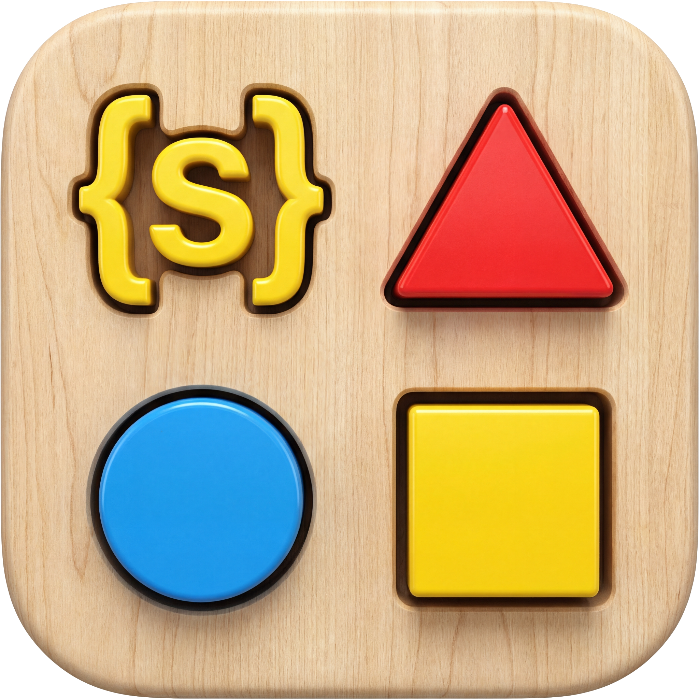

<div align="center">
    
</div>
<h1 align="center">Struktur</h1>

Struktur is a structured data extraction engine that turns pre-parsed artifacts into validated JSON using the Vercel AI SDK. It chunks content by token budgets, runs strategy-driven workflows, validates with Ajv, and merges or dedupes when needed.

## Highlights

- Strategy-driven extraction: simple, parallel, sequential, auto-merge, or double-pass.
- Token-aware batching with optional image limits.
- Schema-first validation with Ajv retries on failure.
- Merge and dedupe with schema-aware rules and CRC32 hashing.
- Typed results with Ajv `JSONSchemaType<T>`.

## Installation

```sh
bun install @mateffy/struktur
```

## Quick start

```ts
import { extract, simple } from "@mateffy/struktur";
import type { JSONSchemaType } from "ajv";
import { google } from "@ai-sdk/google";

type Output = { title: string };

const schema: JSONSchemaType<Output> = {
  type: "object",
  properties: { title: { type: "string" } },
  required: ["title"],
  additionalProperties: false,
};

const result = await extract({
  artifacts: [/* Artifact[] */],
  schema,
  strategy: simple({ model: google("claude-haiku-4-5") }),
});

console.log(result.data.title);
```

## How it works

```
extract()
  -> strategy.run()
     -> batchArtifacts() / splitArtifact()
        -> prompt builder(s)
           -> runWithRetries()
              -> Ajv validation / retry
              -> merge / dedupe (strategy-specific)
```

## Strategies

- `simple`: single-shot extraction. Best for small inputs.
- `parallel`: concurrent batches, then LLM merge.
- `sequential`: batches processed in order with context carryover.
- `parallelAutoMerge`: schema-aware merge + hash dedupe + LLM dedupe.
- `sequentialAutoMerge`: sequential merge with dedupe pass.
- `doublePass`: parallel merge, then sequential refinement.
- `doublePassAutoMerge`: auto-merge first, then sequential refinement.

Common options (varies by strategy):

- `model`: base extraction model.
- `mergeModel`: optional merge model (parallel/double pass).
- `dedupeModel`: optional dedupe model (auto-merge strategies).
- `chunkSize`: token budget per batch.
- `maxImages`: optional image limit per batch.
- `concurrency`: maximum parallel batches.
- `outputInstructions`: extra system output instructions.

```ts
import { extract, parallel } from "@mateffy/struktur";
import { google } from "@ai-sdk/google";

const result = await extract({
  artifacts,
  schema,
  strategy: parallel({
    model: google("claude-haiku-4-5"),
    mergeModel: google("claude-haiku-4-5"),
    chunkSize: 10_000,
    concurrency: 4,
  }),
});
```

## Artifacts

Artifacts are JSON DTOs with text and media slices. Struktur does not parse PDFs or HTML; it expects normalized inputs.

```ts
import { urlToArtifact, fileToArtifact } from "@mateffy/struktur";

const artifact = await urlToArtifact("https://example.com/artifact.json");

const providers = {
  "application/pdf": async (buffer) => ({
    id: "pdf-1",
    type: "pdf",
    raw: async () => buffer,
    contents: [{ page: 1, text: "..." }],
  }),
};

const fromFile = await fileToArtifact(buffer, { mimeType: "application/pdf", providers });
```

## Events

Use events for progress and validation retries.

```ts
const result = await extract({
  artifacts,
  schema,
  strategy,
  events: {
    onStep: ({ step, total, label }) => {
      console.log("step", step, total, label);
    },
    onMessage: ({ role, content }) => {
      console.log(role, content);
    },
  },
});
```

## Debug Mode

Enable verbose JSON logging to stderr with the `--debug` flag:

```bash
struktur extract --debug -t "text to extract" -s schema.json
```

This outputs detailed information about:
- CLI initialization and configuration
- Artifact loading (count, tokens, images)
- Chunking and batching decisions
- Strategy execution steps
- LLM calls (prompts, responses, tokens, timing)
- Validation attempts and retries
- Merging and deduplication operations
- Final extraction results

All logs are single-line JSON for easy parsing:

```json
{"timestamp":"2026-02-24T20:00:00.000Z","type":"cli_init","args":{"strategy":"simple"}}
{"timestamp":"2026-02-24T20:00:00.001Z","type":"artifacts_loaded","count":3,"totalTokens":15000}
{"timestamp":"2026-02-24T20:00:00.002Z","type":"batching_complete","totalBatches":2,"batches":[{"index":0,"artifactCount":2,"tokens":10000},{"index":1,"artifactCount":1,"tokens":5000}]}
```

## Testing

```sh
bun test
```

## Documentation

- Landing page: `docs/index.html`
- Full guide: `docs/guide.html`
