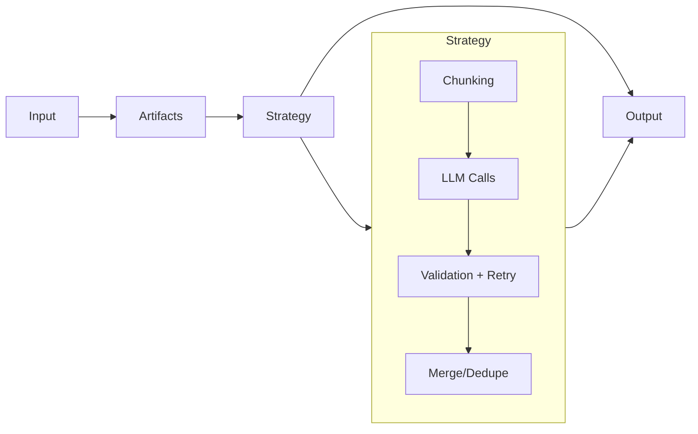

## Inputs and Artifacts

Struktur operates on **Artifacts**, not raw files. The boundary is intentional — you handle parsing (PDF → text, HTML → markdown), Struktur handles extraction. This keeps the tool focused and lets you use best-of-breed parsers per format.

See [Artifacts](./artifacts) for the artifact concept.

## The Strategy layer

A strategy is the orchestration engine. It decides how to split the input, how many LLM calls to make, whether to run them concurrently or sequentially, and how to combine results.

Built-in strategies cover the common patterns. You can also write your own.

See [Strategies](./strategies) for the strategy concept.

## Validation inside the loop

The validation loop is a key differentiator. Every LLM response is validated against the schema using Ajv **before** the strategy considers it done. If validation fails, the errors are serialized and sent back to the model as a follow-up message.

**Smart validation**: For multi-step strategies (parallel, sequential, double-pass), Struktur uses lenient validation during intermediate steps—required field violations are allowed until the final step. This prevents false failures when data is split across chunks. Use the `strict` option to disable this behavior.

Most extractions converge within two attempts. This happens **inside** the strategy, not as a post-processing step.

Default: `maxAttempts` = 3.

See [Validation & Retries](./validation) for the validation concept.

## The result

The extraction result has three fields:

| Field | Description |
|-------|-------------|
| `data` | Validated output matching your schema. If `error` is set, may not be trustworthy. |
| `usage` | Aggregated token counts across all LLM calls. |
| `error` | Set if extraction encountered a non-fatal error. |

## See also

- [Artifacts](./artifacts) — the input format
- [Strategies](./strategies) — orchestration patterns
- [Chunking & Token Budgets](./chunking) — how large documents are split
- [Validation & Retries](./validation) — the retry loop