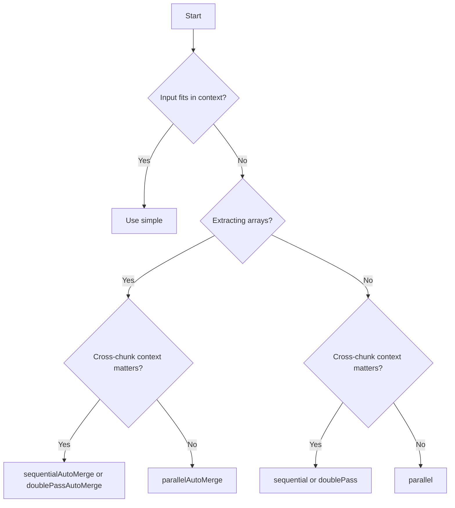

# Choosing a Strategy

Decision guide for selecting the right extraction strategy.

## Quick decision flowchart



## Strategy comparison

| Strategy | Speed | Context | Arrays | Token Cost |
|----------|-------|---------|--------|-----------|
| `simple` | Fastest | Full | — | Lowest |
| `parallel` | Fast | None | LLM merge | Medium |
| `sequential` | Medium | Full | Context | Medium |
| `parallelAutoMerge` | Fast | None | Auto + dedupe | Medium |
| `sequentialAutoMerge` | Medium | Full | Auto + dedupe | Medium |
| `doublePass` | Slow | Full | LLM merge | High |
| `doublePassAutoMerge` | Slow | Full | Auto + dedupe | High |

## Worked examples

### 50-page PDF invoice with 200 line items

**Use:** `parallelAutoMerge` or `sequentialAutoMerge`

```bash
struktur --input invoice.pdf --schema invoice.json --strategy parallelAutoMerge --model openai/gpt-4o-mini
```

Choose `sequentialAutoMerge` if line items span page boundaries and reference earlier context.

### 3-page real estate exposé with floor plan images

**Use:** `sequential` or `sequentialAutoMerge`

```bash
struktur --input expose.pdf --schema property.json --strategy sequentialAutoMerge --model openai/gpt-4o-mini
```

Images are handled by vision models without OCR.

### 2-page contract — parties, dates, value

**Use:** `simple` or `sequential`

```bash
struktur --input contract.pdf --schema contract.json --model openai/gpt-4o-mini
```

`simple` if it fits in context; `sequential` if you need incremental building.

### 500 product datasheets

**Use:** `parallelAutoMerge` with concurrency

```bash
for f in datasheets/*.pdf; do
  markitdown "$f" | struktur --stdin --schema product.json --strategy parallelAutoMerge --model openai/gpt-4o-mini
done | jq -s '.'
```

## When speed matters

Use `parallel` or `parallelAutoMerge`. Accept that cross-chunk context is limited.

## When quality matters

Use `doublePass` or `doublePassAutoMerge`. Accept higher token cost.

## When arrays matter

Use auto-merge variants (`parallelAutoMerge`, `sequentialAutoMerge`, `doublePassAutoMerge`). They handle deduplication automatically.

## See also

- [Strategies](./index) — all strategies
- [simple](./simple) — single-shot extraction
- [parallel](./parallel) — concurrent processing
- [sequential](./sequential) — ordered processing
