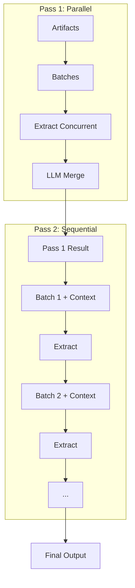

## At a glance

| Property | Value |
|----------|-------|
| Name | `"double-pass"` |
| LLM calls | N × 2 batches + 1 merge |
| Parallelism | First pass full, second pass none |
| Merge step | LLM merge (pass 1), context carryover (pass 2) |
| Dedupe step | None |
| Best for | High-stakes extraction, maximum quality |

## Configuration

| Field | Required | Default | Description |
|-------|----------|---------|-------------|
| `model` | Yes | - | Model for extraction |
| `mergeModel` | Yes | - | Model for merging partial results |
| `chunkSize` | Yes | - | Token budget per batch |
| `concurrency` | No | All batches | Max parallel batches |
| `maxImages` | No | Unlimited | Max images per batch |
| `outputInstructions` | No | - | Extra instructions |
| `strict` | No | `false` | Validate required fields on every step (disables smart validation) |

## Algorithm

**Pass 1 (parallel):**

1. Split artifacts into batches
2. Extract from each batch concurrently
3. Validate each batch output with retry
4. LLM merge all partial results

**Pass 2 (sequential):**

5. For each batch in order:
   - Build prompt including pass 1 result as context
   - Extract from batch
   - Validate with retry
   - Store result for next iteration
6. Return final result



## Validation behavior

Each batch extraction (both passes) is validated with retry. The pass 1 merge is also validated.

## Merge behavior

**Pass 1:** LLM merge. All partial results sent to merge model.

**Pass 2:** Context carryover. Each batch sees previous pass 2 result as context.

## Token cost profile

**High** — 2 × N extraction calls + 1 merge call. Highest cost strategy.

## Example

```js
import { extract, doublePass } from "@mateffy/struktur";
import { openai } from "@ai-sdk/openai";

const result = await extract({
  artifacts,
  schema,
  strategy: doublePass({
    model: openai("gpt-4o-mini"),
    mergeModel: openai("gpt-4o-mini"),
    chunkSize: 10000,
  }),
});
```

## CLI

```bash
struktur --input critical.pdf --schema schema.json --strategy doublePass --model openai/gpt-4o
```

## When to use

- Accuracy is more important than cost
- High-stakes extractions
- Complex schemas
- Can afford two full passes

## When to avoid

- Cost is a concern (use `parallel` or `sequential`)
- Speed is critical
- Schema is simple (use `simple`)

## See also

- [doublePassAutoMerge](./double-pass-auto-merge) — for array extraction
- [parallel](./parallel) — for speed priority
- [sequential](./sequential) — for single-pass sequential
- [Choosing a Strategy](./choosing) — decision guide