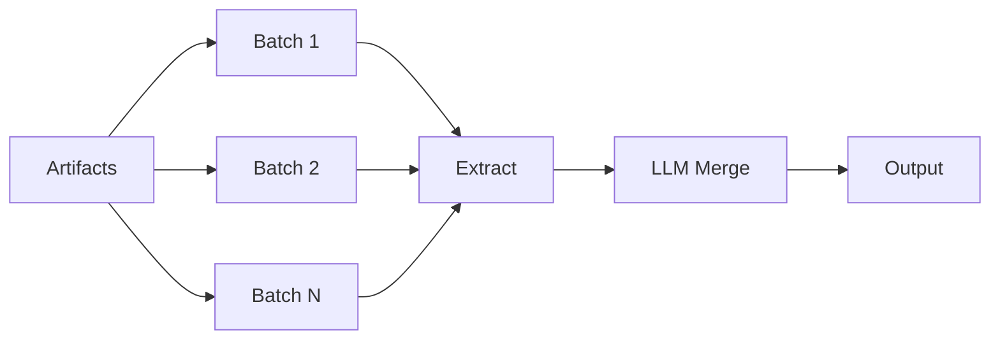

## At a glance

| Property | Value |
|----------|-------|
| Name | `"parallel"` |
| LLM calls | N batches + 1 merge |
| Parallelism | Full |
| Merge step | LLM merge |
| Dedupe step | None |
| Best for | Large inputs, speed priority |

## Configuration

| Field | Required | Default | Description |
|-------|----------|---------|-------------|
| `model` | Yes | - | Model for extraction |
| `mergeModel` | Yes | - | Model for merging partial results |
| `chunkSize` | Yes | - | Token budget per batch |
| `concurrency` | No | All batches | Max parallel batches |
| `maxImages` | No | Unlimited | Max images per batch |
| `outputInstructions` | No | - | Extra instructions |
| `strict` | No | `false` | Validate required fields on every step (disables smart validation) |

## Algorithm

1. Split artifacts into batches (respecting `chunkSize` and `maxImages`)
2. Extract from each batch concurrently
3. Validate each batch output with retry
4. Send all partial results to `mergeModel` for LLM merge
5. Validate merged output
6. Return final result



## Validation behavior

Each batch extraction is validated with retry. The final merge is also validated.

## Merge behavior

LLM merge. All partial results are sent to a merge model with a prompt asking it to produce a single coherent output. The merge model sees the full schema and all partial outputs.

## Token cost profile

**Medium** — N extraction calls + 1 merge call. Merge model can be cheaper than extraction model.

## Example

```js
import { extract, parallel } from "@mateffy/struktur";
import { openai } from "@ai-sdk/openai";

const result = await extract({
  artifacts,
  schema,
  strategy: parallel({
    model: openai("gpt-4o-mini"),
    mergeModel: openai("gpt-4o-mini"),
    chunkSize: 10000,
    concurrency: 3,
  }),
});
```

## CLI

```bash
struktur --input large.pdf --schema schema.json --strategy parallel --model openai/gpt-4o-mini
```

## When to use

- Speed is the top priority
- Chunks are relatively independent
- Many documents to process
- Can accept potential loss of cross-chunk context

## When to avoid

- Later chunks depend on earlier chunks (use `sequential`)
- Extracting arrays that may have duplicates (use `parallelAutoMerge`)

## See also

- [sequential](./sequential) — for context-dependent documents
- [parallelAutoMerge](./parallel-auto-merge) — for array extraction with deduplication
- [Choosing a Strategy](./choosing) — decision guide