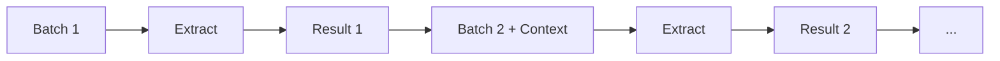

## At a glance

| Property | Value |
|----------|-------|
| Name | `"sequential"` |
| LLM calls | N batches |
| Parallelism | None |
| Merge step | Context carryover |
| Dedupe step | None |
| Best for | Context-dependent documents |

## Configuration

| Field | Required | Default | Description |
|-------|----------|---------|-------------|
| `model` | Yes | - | Model for extraction |
| `chunkSize` | Yes | - | Token budget per batch |
| `maxImages` | No | Unlimited | Max images per batch |
| `outputInstructions` | No | - | Extra instructions |
| `strict` | No | `false` | Validate required fields on every step (disables smart validation) |

## Algorithm

1. Split artifacts into batches
2. For each batch in order:
   - Build prompt including previous extraction result as context
   - Extract from batch
   - Validate with retry
   - Store result for next iteration
3. Return final result



## Validation behavior

Each batch extraction is validated with retry. No separate merge step — the final batch result is the output.

## Merge behavior

Context carryover. Each batch receives the previous extraction result as context in its prompt. This allows later chunks to build on earlier ones.

## Token cost profile

**Medium** — N extraction calls, no merge call. Each call includes context from previous results.

## Example

```js
import { extract, sequential } from "@mateffy/struktur";
import { openai } from "@ai-sdk/openai";

const result = await extract({
  artifacts,
  schema,
  strategy: sequential({
    model: openai("gpt-4o-mini"),
    chunkSize: 10000,
  }),
});
```

## CLI

```bash
struktur --input report.pdf --schema schema.json --strategy sequential --model openai/gpt-4o-mini
```

## When to use

- Context between chunks matters
- Building data incrementally (e.g., accumulating line items)
- Later sections reference earlier sections
- Need better accuracy than parallel

## When to avoid

- Speed is critical (use `parallel`)
- Extracting arrays that may have duplicates (use `sequentialAutoMerge`)

## See also

- [parallel](./parallel) — for speed priority
- [sequentialAutoMerge](./sequential-auto-merge) — for array extraction with deduplication
- [Choosing a Strategy](./choosing) — decision guide