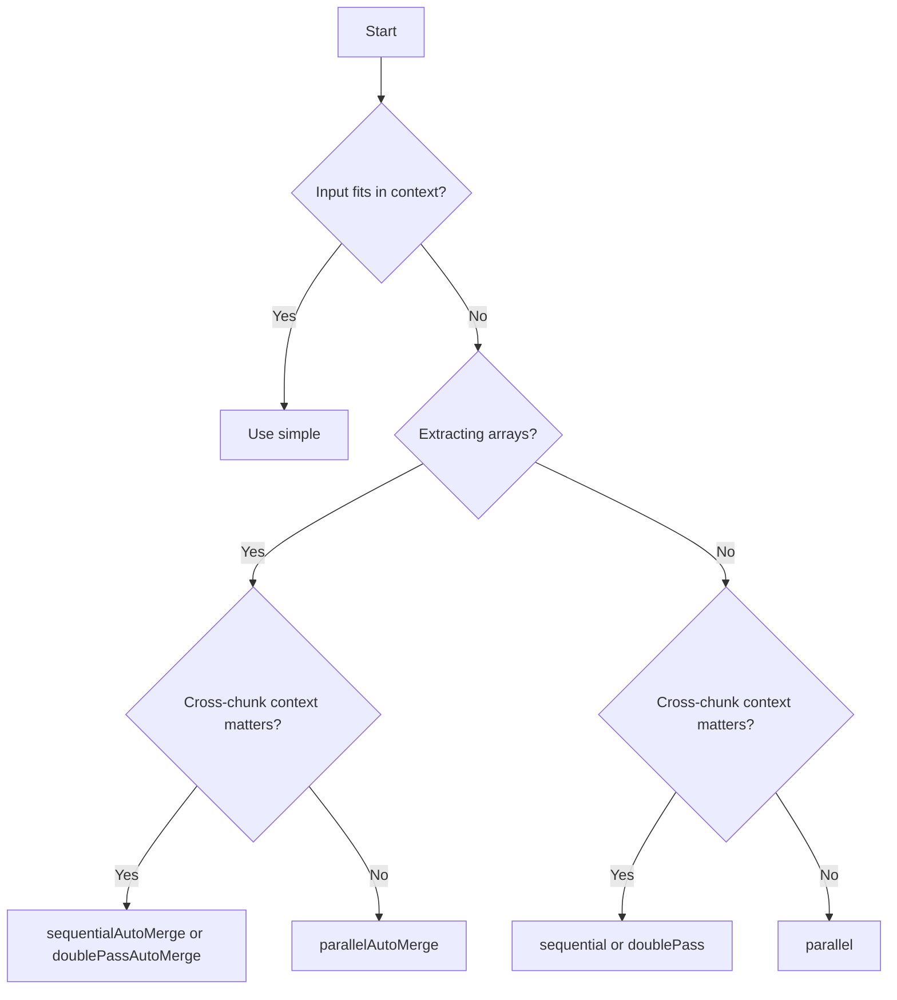

A strategy is the orchestration engine. It decides how to split the input, how many LLM calls to make, whether to run them concurrently or sequentially, and how to combine results.

Strategy comparison [#strategy-comparison]

| Strategy              | Speed   | Context | Arrays        | Token Cost |
| --------------------- | ------- | ------- | ------------- | ---------- |
| `simple`              | Fastest | Full    | —             | Lowest     |
| `parallel`            | Fast    | None    | LLM merge     | Medium     |
| `sequential`          | Medium  | Full    | Context       | Medium     |
| `parallelAutoMerge`   | Fast    | None    | Auto + dedupe | Medium     |
| `sequentialAutoMerge` | Medium  | Full    | Auto + dedupe | Medium     |
| `doublePass`          | Slow    | Full    | LLM merge     | High       |
| `doublePassAutoMerge` | Slow    | Full    | Auto + dedupe | High       |

***

simple [#simple]

Single-shot extraction for small inputs.

| Property    | Value                      |
| ----------- | -------------------------- |
| Name        | `"simple"`                 |
| LLM calls   | 1                          |
| Parallelism | None                       |
| Merge step  | None                       |
| Dedupe step | None                       |
| Best for    | Small, single-chunk inputs |

Configuration [#configuration]

| Field                | Required | Default | Description                                                   |
| -------------------- | -------- | ------- | ------------------------------------------------------------- |
| `model`              | Yes      | -       | Model instance from `@ai-sdk/*`                               |
| `outputInstructions` | No       | -       | Extra instructions for the model                              |
| `strict`             | No       | `false` | Always `true` for simple (single-shot, no intermediate steps) |

Algorithm [#algorithm]

1. Build extraction prompt from artifacts + schema
2. Send to LLM
3. Validate output against the schema
4. Retry on validation failure (up to 3 attempts)
5. Return validated output

Example [#example]

```js
import { extract, simple } from "@struktur/sdk";
import { openai } from "@ai-sdk/openai";

const result = await extract({
  artifacts,
  schema,
  strategy: simple({
    model: openai("gpt-4o-mini"),
  }),
});
```

CLI [#cli]

```bash
struktur --input document.txt --schema schema.json --model openai/gpt-4o-mini
# --strategy simple is the default
```

When to use [#when-to-use]

* Document fits within the model's context window (\~10k tokens)
* Simple schema without nested arrays
* Testing or prototyping
* Speed is the priority

***

parallel [#parallel]

Concurrent batch processing with LLM merge.

| Property    | Value                        |
| ----------- | ---------------------------- |
| Name        | `"parallel"`                 |
| LLM calls   | N batches + 1 merge          |
| Parallelism | Full                         |
| Merge step  | LLM merge                    |
| Dedupe step | None                         |
| Best for    | Large inputs, speed priority |

Configuration [#configuration-1]

| Field                | Required | Default     | Description                            |
| -------------------- | -------- | ----------- | -------------------------------------- |
| `model`              | Yes      | -           | Model for extraction                   |
| `mergeModel`         | Yes      | -           | Model for merging partial results      |
| `chunkSize`          | Yes      | -           | Token budget per batch                 |
| `concurrency`        | No       | All batches | Max parallel batches                   |
| `maxImages`          | No       | Unlimited   | Max images per batch                   |
| `outputInstructions` | No       | -           | Extra instructions                     |
| `strict`             | No       | `false`     | Validate required fields on every step |

Algorithm [#algorithm-1]

1. Split artifacts into batches (respecting `chunkSize` and `maxImages`)
2. Extract from each batch concurrently
3. Validate each batch output with retry
4. Send all partial results to `mergeModel` for LLM merge
5. Validate merged output
6. Return final result

Example [#example-1]

```js
import { extract, parallel } from "@struktur/sdk";
import { openai } from "@ai-sdk/openai";

const result = await extract({
  artifacts,
  schema,
  strategy: parallel({
    model: openai("gpt-4o-mini"),
    mergeModel: openai("gpt-4o-mini"),
    chunkSize: 10000,
    concurrency: 3,
  }),
});
```

CLI [#cli-1]

```bash
struktur --input large.pdf --schema schema.json --strategy parallel --model openai/gpt-4o-mini
```

When to use [#when-to-use-1]

* Speed is the top priority
* Chunks are relatively independent
* Many documents to process
* Can accept potential loss of cross-chunk context

***

sequential [#sequential]

Process chunks in order with context preservation.

| Property    | Value                       |
| ----------- | --------------------------- |
| Name        | `"sequential"`              |
| LLM calls   | N batches                   |
| Parallelism | None                        |
| Merge step  | Context carryover           |
| Dedupe step | None                        |
| Best for    | Context-dependent documents |

Configuration [#configuration-2]

| Field                | Required | Default   | Description                            |
| -------------------- | -------- | --------- | -------------------------------------- |
| `model`              | Yes      | -         | Model for extraction                   |
| `chunkSize`          | Yes      | -         | Token budget per batch                 |
| `maxImages`          | No       | Unlimited | Max images per batch                   |
| `outputInstructions` | No       | -         | Extra instructions                     |
| `strict`             | No       | `false`   | Validate required fields on every step |

Algorithm [#algorithm-2]

1. Split artifacts into batches
2. For each batch in order:
   * Build prompt including previous extraction result as context
   * Extract from batch
   * Validate with retry
   * Store result for next iteration
3. Return final result

Example [#example-2]

```js
import { extract, sequential } from "@struktur/sdk";
import { openai } from "@ai-sdk/openai";

const result = await extract({
  artifacts,
  schema,
  strategy: sequential({
    model: openai("gpt-4o-mini"),
    chunkSize: 10000,
  }),
});
```

CLI [#cli-2]

```bash
struktur --input report.pdf --schema schema.json --strategy sequential --model openai/gpt-4o-mini
```

When to use [#when-to-use-2]

* Context between chunks matters
* Building data incrementally (e.g., accumulating line items)
* Later sections reference earlier sections
* Need better accuracy than parallel

***

parallelAutoMerge [#parallelautomerge]

Parallel extraction with schema-aware merge and deduplication.

| Property    | Value                                 |
| ----------- | ------------------------------------- |
| Name        | `"parallel-auto-merge"`               |
| LLM calls   | N batches + 1 dedupe                  |
| Parallelism | Full                                  |
| Merge step  | Schema-aware auto-merge               |
| Dedupe step | CRC32 hash + LLM semantic             |
| Best for    | Array extraction, duplicates possible |

Configuration [#configuration-3]

| Field                | Required | Default         | Description                            |
| -------------------- | -------- | --------------- | -------------------------------------- |
| `model`              | Yes      | -               | Model for extraction                   |
| `chunkSize`          | Yes      | -               | Token budget per batch                 |
| `concurrency`        | No       | All batches     | Max parallel batches                   |
| `maxImages`          | No       | Unlimited       | Max images per batch                   |
| `outputInstructions` | No       | -               | Extra instructions                     |
| `dedupeModel`        | No       | Same as `model` | Model for semantic dedupe              |
| `strict`             | No       | `false`         | Validate required fields on every step |

Algorithm [#algorithm-3]

1. Split artifacts into batches
2. Extract from each batch concurrently
3. Validate each batch output with retry
4. **Schema-aware merge:** arrays concatenate, objects shallow-merge, scalars prefer new values
5. **Hash dedupe:** CRC32 to remove exact duplicates
6. **Semantic dedupe:** LLM identifies semantically equivalent entries
7. Return final result

Merge behavior [#merge-behavior]

Schema-aware auto-merge via `SmartDataMerger`:

* **Arrays:** concatenated
* **Objects:** shallow-merged (later keys overwrite earlier)
* **Scalars:** prefer newer non-empty values

No LLM merge call — deterministic.

Deduplication [#deduplication]

Two-stage:

1. **CRC32 hash:** Exact duplicates removed without LLM call
2. **LLM semantic:** Model identifies near-duplicates (e.g., "iPhone 15" vs "Apple iPhone 15 128GB")

Example [#example-3]

```js
import { extract, parallelAutoMerge } from "@struktur/sdk";
import { openai } from "@ai-sdk/openai";

const result = await extract({
  artifacts,
  schema,
  strategy: parallelAutoMerge({
    model: openai("gpt-4o-mini"),
    dedupeModel: openai("gpt-4o-mini"),
    chunkSize: 10000,
    concurrency: 3,
  }),
});
```

CLI [#cli-3]

```bash
struktur --input catalog.pdf --schema schema.json --strategy parallelAutoMerge --model openai/gpt-4o-mini
```

When to use [#when-to-use-3]

* Extracting arrays that may have duplicates across chunks
* Want to consolidate results without LLM merge cost
* Documents have repeated information across pages
* Need deterministic merge behavior

Best for: invoices with line items, real estate with multiple units, catalogs with products that appear on multiple pages.

***

sequentialAutoMerge [#sequentialautomerge]

Sequential extraction with schema-aware merge and deduplication.

| Property    | Value                                     |
| ----------- | ----------------------------------------- |
| Name        | `"sequential-auto-merge"`                 |
| LLM calls   | N batches + 1 dedupe                      |
| Parallelism | None                                      |
| Merge step  | Schema-aware auto-merge                   |
| Dedupe step | CRC32 hash + LLM semantic                 |
| Best for    | Ordered array extraction, context matters |

Configuration [#configuration-4]

| Field                | Required | Default         | Description                            |
| -------------------- | -------- | --------------- | -------------------------------------- |
| `model`              | Yes      | -               | Model for extraction                   |
| `chunkSize`          | Yes      | -               | Token budget per batch                 |
| `maxImages`          | No       | Unlimited       | Max images per batch                   |
| `outputInstructions` | No       | -               | Extra instructions                     |
| `dedupeModel`        | No       | Same as `model` | Model for semantic dedupe              |
| `strict`             | No       | `false`         | Validate required fields on every step |

Algorithm [#algorithm-4]

1. Split artifacts into batches
2. For each batch in order:
   * Extract from batch
   * Validate with retry
   * **Schema-aware merge** with previous results
3. **Hash dedupe:** CRC32 to remove exact duplicates
4. **Semantic dedupe:** LLM identifies semantically equivalent entries
5. Return final result

Example [#example-4]

```js
import { extract, sequentialAutoMerge } from "@struktur/sdk";
import { openai } from "@ai-sdk/openai";

const result = await extract({
  artifacts,
  schema,
  strategy: sequentialAutoMerge({
    model: openai("gpt-4o-mini"),
    dedupeModel: openai("gpt-4o-mini"),
    chunkSize: 10000,
  }),
});
```

CLI [#cli-4]

```bash
struktur --input invoice.pdf --schema schema.json --strategy sequentialAutoMerge --model openai/gpt-4o-mini
```

When to use [#when-to-use-4]

* Ordered list extraction with cross-chunk dependencies
* Later chunks need context from earlier chunks
* Arrays may have duplicates across pages
* Context preservation matters

Best for: multi-page invoices with line items that span pages, real estate exposés with units referenced across pages.

***

doublePass [#doublepass]

Parallel pass for speed, sequential pass for refinement.

| Property    | Value                                          |
| ----------- | ---------------------------------------------- |
| Name        | `"double-pass"`                                |
| LLM calls   | N × 2 batches + 1 merge                        |
| Parallelism | First pass full, second pass none              |
| Merge step  | LLM merge (pass 1), context carryover (pass 2) |
| Dedupe step | None                                           |
| Best for    | High-stakes extraction, maximum quality        |

Configuration [#configuration-5]

| Field                | Required | Default     | Description                            |
| -------------------- | -------- | ----------- | -------------------------------------- |
| `model`              | Yes      | -           | Model for extraction                   |
| `mergeModel`         | Yes      | -           | Model for merging partial results      |
| `chunkSize`          | Yes      | -           | Token budget per batch                 |
| `concurrency`        | No       | All batches | Max parallel batches                   |
| `maxImages`          | No       | Unlimited   | Max images per batch                   |
| `outputInstructions` | No       | -           | Extra instructions                     |
| `strict`             | No       | `false`     | Validate required fields on every step |

Algorithm [#algorithm-5]

**Pass 1 (parallel):**

1. Split artifacts into batches
2. Extract from each batch concurrently
3. Validate each batch output with retry
4. LLM merge all partial results

**Pass 2 (sequential):**

5. For each batch in order:
   * Build prompt including pass 1 result as context
   * Extract from batch
   * Validate with retry
   * Store result for next iteration
6. Return final result

Example [#example-5]

```js
import { extract, doublePass } from "@struktur/sdk";
import { openai } from "@ai-sdk/openai";

const result = await extract({
  artifacts,
  schema,
  strategy: doublePass({
    model: openai("gpt-4o-mini"),
    mergeModel: openai("gpt-4o-mini"),
    chunkSize: 10000,
  }),
});
```

CLI [#cli-5]

```bash
struktur --input critical.pdf --schema schema.json --strategy doublePass --model openai/gpt-4o
```

When to use [#when-to-use-5]

* Accuracy is more important than cost
* High-stakes extractions
* Complex schemas
* Can afford two full passes

***

doublePassAutoMerge [#doublepassautomerge]

Double-pass extraction with schema-aware merge and deduplication.

| Property    | Value                                   |
| ----------- | --------------------------------------- |
| Name        | `"double-pass-auto-merge"`              |
| LLM calls   | N × 2 batches + 1 dedupe                |
| Parallelism | First pass full, second pass none       |
| Merge step  | Schema-aware auto-merge                 |
| Dedupe step | CRC32 hash + LLM semantic               |
| Best for    | Large array extraction, maximum quality |

Configuration [#configuration-6]

| Field                | Required | Default         | Description                            |
| -------------------- | -------- | --------------- | -------------------------------------- |
| `model`              | Yes      | -               | Model for extraction                   |
| `chunkSize`          | Yes      | -               | Token budget per batch                 |
| `concurrency`        | No       | All batches     | Max parallel batches                   |
| `maxImages`          | No       | Unlimited       | Max images per batch                   |
| `outputInstructions` | No       | -               | Extra instructions                     |
| `dedupeModel`        | No       | Same as `model` | Model for semantic dedupe              |
| `strict`             | No       | `false`         | Validate required fields on every step |

Algorithm [#algorithm-6]

**Pass 1 (parallel):**

1. Split artifacts into batches
2. Extract from each batch concurrently
3. Validate each batch output with retry
4. **Schema-aware merge** all partial results
5. **Hash dedupe:** CRC32
6. **Semantic dedupe:** LLM

**Pass 2 (sequential):**

7. For each batch in order:
   * Build prompt including deduped pass 1 result as context
   * Extract from batch
   * Validate with retry
   * Store result for next iteration
8. Return final result

Example [#example-6]

```js
import { extract, doublePassAutoMerge } from "@struktur/sdk";
import { openai } from "@ai-sdk/openai";

const result = await extract({
  artifacts,
  schema,
  strategy: doublePassAutoMerge({
    model: openai("gpt-4o-mini"),
    dedupeModel: openai("gpt-4o-mini"),
    chunkSize: 10000,
  }),
});
```

CLI [#cli-6]

```bash
struktur --input catalog.pdf --schema schema.json --strategy doublePassAutoMerge --model openai/gpt-4o
```

When to use [#when-to-use-6]

* Large array extraction with maximum quality requirement
* Arrays may have duplicates
* Cross-chunk context matters
* Quality trumps cost

***

Choosing a Strategy [#choosing-a-strategy]

Pick based on input size and whether you're extracting arrays:

| Strategy              | When to use                                      |
| --------------------- | ------------------------------------------------ |
| `simple`              | Small input, fits in one context window          |
| `parallel`            | Large input, order doesn't matter, scalar fields |
| `sequential`          | Large input, context carries across chunks       |
| `parallelAutoMerge`   | Large input with arrays — parallel + dedup       |
| `sequentialAutoMerge` | Large input with arrays — sequential + dedup     |
| `doublePass`          | Quality matters, two-pass refinement             |
| `doublePassAutoMerge` | Quality + arrays + dedup                         |

When speed matters [#when-speed-matters]

Use `parallel` or `parallelAutoMerge`. Accept that cross-chunk context is limited.

When quality matters [#when-quality-matters]

Use `doublePass` or `doublePassAutoMerge`. Accept higher token cost.

When arrays matter [#when-arrays-matter]

Use auto-merge variants (`parallelAutoMerge`, `sequentialAutoMerge`, `doublePassAutoMerge`). They handle deduplication automatically.

Quick decision flowchart [#quick-decision-flowchart]



Worked examples [#worked-examples]

50-page PDF invoice with 200 line items [#50-page-pdf-invoice-with-200-line-items]

**Use:** `parallelAutoMerge` or `sequentialAutoMerge`

```bash
struktur --input invoice.pdf --schema invoice.json --strategy parallelAutoMerge --model openai/gpt-4o-mini
```

Choose `sequentialAutoMerge` if line items span page boundaries and reference earlier context.

3-page real estate exposé with floor plan images [#3-page-real-estate-exposé-with-floor-plan-images]

**Use:** `sequential` or `sequentialAutoMerge`

```bash
struktur --input expose.pdf --schema property.json --strategy sequentialAutoMerge --model openai/gpt-4o-mini
```

Images are handled by vision models without OCR.

2-page contract — parties, dates, value [#2-page-contract--parties-dates-value]

**Use:** `simple` or `sequential`

```bash
struktur --input contract.pdf --schema contract.json --model openai/gpt-4o-mini
```

`simple` if it fits in context; `sequential` if you need incremental building.

500 product datasheets [#500-product-datasheets]

**Use:** `parallelAutoMerge` with concurrency

```bash
for f in datasheets/*.pdf; do
  markitdown "$f" | struktur --stdin --schema product.json --strategy parallelAutoMerge --model openai/gpt-4o-mini
done | jq -s '.'
```

***

Writing a Custom Strategy [#writing-a-custom-strategy]

The interface [#the-interface]

A strategy has:

```js
const myStrategy = {
  name: "my-strategy",

  // Optional: used by CLI progress bar.
  getEstimatedSteps(artifacts) {
    return 3;
  },

  async run(options) {
    // Your orchestration logic here.
    return { data: ..., usage: { inputTokens: 0, outputTokens: 0, totalTokens: 0 } };
  },
};
```

Using built-in helpers [#using-built-in-helpers]

Key internal helpers from `strategies/utils.ts`:

| Helper                                                                            | Description                              |
| --------------------------------------------------------------------------------- | ---------------------------------------- |
| `getBatches(artifacts, { maxTokens, maxImages? })`                                | Chunk artifacts into batches             |
| `extractWithPrompt({ model, schema, system, user, artifacts, events, execute? })` | Run one LLM extraction with retries      |
| `serializeSchema(schema)`                                                         | Convert schema to JSON string for prompt |
| `mergeUsage([...usages])`                                                         | Accumulate usage across calls            |

A complete example [#a-complete-example]

```js
import { extractWithPrompt, getBatches, mergeUsage, serializeSchema } from "@struktur/sdk/strategies/utils";
import { buildExtractorPrompt } from "@struktur/sdk/prompts/ExtractorPrompt";

const myStrategy = (config) => ({
  name: "my-strategy",

  getEstimatedSteps(artifacts) {
    const batches = getBatches(artifacts, { maxTokens: config.chunkSize });
    return batches.length + 1;
  },

  async run(options) {
    const batches = getBatches(options.artifacts, {
      maxTokens: config.chunkSize,
    });

    const schema = serializeSchema(options.schema);
    const usages = [];
    let currentData = {};

    for (const [index, batch] of batches.entries()) {
      const prompt = buildExtractorPrompt(batch, schema);

      const result = await extractWithPrompt({
        model: config.model,
        schema: options.schema,
        system: prompt.system,
        user: prompt.user,
        artifacts: batch,
        events: options.events,
      });

      currentData = { ...currentData, ...result.data };
      usages.push(result.usage);

      await options.events?.onStep?.({
        step: index + 1,
        total: batches.length + 1,
        label: `batch ${index + 1}/${batches.length}`,
      });
    }

    return { data: currentData, usage: mergeUsage(usages) };
  },
});
```

Emitting step events [#emitting-step-events]

Strategies should emit `events.onStep` for progress tracking:

```js
await options.events?.onStep?.({
  step: 1,
  total: 3,
  label: "extract",
});
```

***

See also [#see-also]

* [The Extraction Pipeline](/docs/explanation/pipeline) — where strategies fit
* [Chunking & Token Budgets](/docs/explanation/chunking) — how batches are formed
* [Validation & Retries](/docs/explanation/validation) — the retry loop
