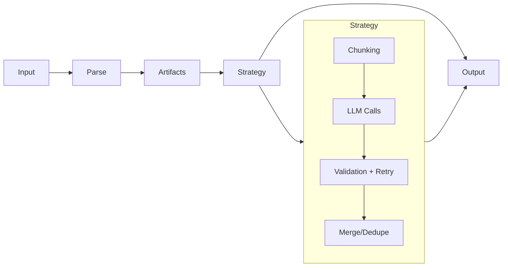

# Documentation Rework Plan

## Executive Summary

The current documentation is significantly outdated. The CLI has been restructured with new command hierarchies, and a major new feature (parsing) has been added that contradicts the previous "no parsing" stance. This plan outlines a complete documentation overhaul.

---

## Critical Issues with Current Documentation

### 1. CLI Command Structure is Wrong

**Current docs say:**
- `struktur auth set --provider openai --token-stdin`
- `struktur auth default openai`
- `struktur models`
- `struktur verify`

**Actual commands are:**
- `struktur config providers add openai --token-stdin`
- `struktur config models use openai`
- `struktur config models list`
- `struktur verify` (unchanged)

This affects `cli/auth.mdx`, `cli/models.mdx`, `cli/index.mdx`, `cli/installation.mdx`, `quickstart.mdx`.

### 2. "Why No Parsing" is Now Wrong

The documentation explicitly states "Struktur does not parse PDFs, HTML, Word docs, or images." This is now **false**. Struktur includes:
- Built-in PDF parser (`parsePdf` in `src/parsers/pdf.ts`) — extracts per-page text, embedded images, and page screenshots
- Configurable parser system (`src/parsers/runner.ts`) — npm packages or shell commands, keyed by MIME type
- `struktur parse` command to convert files to artifact JSON
- Full MIME detection (magic bytes → npm `detectFileType` → extension database)

The "why-no-parsing.mdx" page must be deleted, and `index.mdx` must remove "It does not parse PDFs, HTML, Word docs, or images."

### 3. `environment.mdx` Contains Completely Wrong Variables

The file lists `GOOGLE_API_KEY` and `MIXEDBREAD_API_KEY` — neither exists in the codebase. The correct variables (from `src/auth/tokens.ts`) are:
- `OPENAI_API_KEY`
- `ANTHROPIC_API_KEY`
- `GOOGLE_GENERATIVE_AI_API_KEY`
- `OPENCODE_API_KEY`
- `OPENROUTER_API_KEY`

It also lists wrong variable names for config: `STRUKTUR_CONFIG_PATH` (wrong) and `STRUKTUR_TOKEN_STORAGE` (wrong). The correct ones are `STRUKTUR_CONFIG_DIR`, `STRUKTUR_DISABLE_KEYCHAIN`, `STRUKTUR_KEYCHAIN_SERVICE`.

### 4. Missing Documentation for New Features

- **`parse` command** — converts files to artifact JSON (fully implemented, no docs)
- **`config` command tree** — replaces `auth` and `models` (implemented, no docs)
- **`config parsers` subcommands** — add/remove/list/get parsers by MIME type
- **`config models alias`** — create model shortcuts; used transparently in `--model` and stored default
- **`utils artifact-viewer`** — generates interactive HTML viewer for artifact JSON
- **Image extraction flags** — `--images`, `--screenshots`, `--screenshot-scale`, `--screenshot-width` on both `extract` and `parse`
- **MIME/parser overrides** — `--mime`, `--parser`, `--no-parse` on `extract`
- **`--debug` flag** — verbose JSON debug logging to stderr (missing from extract docs)
- **`--strict` flag** — strict schema validation mode (missing from extract docs)
- **OpenCode and OpenRouter providers** — both fully supported but undocumented
- **OpenRouter hashtag syntax** — `openrouter/anthropic/claude-3.5-sonnet#cerebras` for provider routing
- **`imageType` field** — `"embedded"` vs `"screenshot"` on `ArtifactImage` (missing from artifact-format docs)
- **npm parser contract** — `parseStream`, `parseFile`, `detectFileType` exports that custom parsers must implement

### 5. `custom-provider.mdx` Describes Obsolete Pattern

The `fileToArtifact(buffer, { providers })` + provider registry pattern is still valid but is now a low-level SDK path, not the primary extension mechanism. The new recommended way to add format support is `struktur config parsers add --mime <type> --npm <package>` (CLI) or passing `parserConfig` to `parseInputToArtifacts` (SDK). `custom-provider.mdx` needs to be updated or restructured to position the two approaches clearly.

### 6. `built-in-inputs.mdx` Has Outdated `parseInputToArtifacts` Signature

`parseInputToArtifacts` now accepts a second options object with `parserConfig`, `includeImages`, `screenshots`, `screenshotScale`, `screenshotWidth`. The docs still show the old `{ providers }` option.

### 7. Examples Use Outdated CLI Commands

`watch-folder.mdx` uses `markitdown "$file" | struktur --stdin` — valid, but could be updated to show `struktur --input "$file"` directly. `extract-invoice.mdx` calls `fileToArtifact(buffer, { mimeType: "application/pdf" })` but the current API no longer accepts PDF via that path — PDF is handled by `parseInputToArtifacts` with the built-in PDF parser.

### 8. `sdk/installation.mdx` Claims AI SDK Packages are Bundled

This needs verification against `package.json`. The actual runtime import is dynamic (`await import("@ai-sdk/openai")`). Whether users need to install these separately must be stated accurately.

---

## Source Files to Reference

### CLI Implementation
- `src/cli.ts` — full command tree (lines 1163–2239 for command definitions)
- `src/cli/shared.ts` — `loadArtifactsFromOptions`, `resolveModel`, schema loading
- `src/cli/AGENTS.md` — canonical command tree reference

### Parsing System
- `src/parsers/types.ts` — `NpmParserDef`, `CommandFileDef`, `CommandStdinDef`, `ParsersConfig`
- `src/parsers/npm.ts` — `ParseStreamFn`, `ParseFileFn`, `DetectFileTypeFn`, `NpmParserModule`
- `src/parsers/mime.ts` — MIME detection (magic bytes → detectFileType → extension)
- `src/parsers/runner.ts` — parser execution (npm, command-file, command-stdin)
- `src/parsers/pdf.ts` — built-in PDF parser, `ParsePdfOptions`
- `src/parsers/AGENTS.md` — parsers module documentation

### Configuration
- `src/auth/config.ts` — `defaultModel`, `aliases`, `parsers` in `~/.config/struktur/config.json`
- `src/auth/tokens.ts` — token storage, `resolveProviderEnvVar` (canonical env var names)
- `src/auth/AGENTS.md` — auth module documentation

### Artifacts & Types
- `src/types.ts` — `Artifact`, `ArtifactContent`, `ArtifactImage` (with `imageType`), `ExtractionOptions`
- `src/artifacts/input.ts` — `parseInputToArtifacts` current signature

---

## Documentation Files

### Files to Delete
1. `docs-src/content/docs/cli/auth.mdx` — replaced by `config.mdx`
2. `docs-src/content/docs/cli/models.mdx` — moved under `config.mdx`
3. `docs-src/content/docs/explanation/preprocessing/why-no-parsing.mdx` — factually wrong, must go

### Files to Update (in priority order)
1. `docs-src/content/docs/cli/meta.json` — new page list
2. `docs-src/content/docs/explanation/preprocessing/meta.json` — remove why-no-parsing
3. `docs-src/content/docs/explanation/meta.json` — add `parsers` page
4. `docs-src/content/docs/index.mdx` — update "What Struktur is NOT"
5. `docs-src/content/docs/quickstart.mdx` — update auth commands, add PDF example
6. `docs-src/content/docs/cli/index.mdx` — reflect actual command tree
7. `docs-src/content/docs/cli/extract.mdx` — add all missing flags; fix provider list
8. `docs-src/content/docs/cli/installation.mdx` — update all `auth` → `config` commands
9. `docs-src/content/docs/cli/environment.mdx` — fix all wrong variable names
10. `docs-src/content/docs/cli/verify.mdx` — minor update (add `--stdin` flag note; update See Also)
11. `docs-src/content/docs/explanation/preprocessing/index.mdx` — update links
12. `docs-src/content/docs/explanation/preprocessing/artifact-format.mdx` — add `imageType` field
13. `docs-src/content/docs/explanation/preprocessing/built-in-inputs.mdx` — update `parseInputToArtifacts` signature
14. `docs-src/content/docs/explanation/preprocessing/custom-provider.mdx` — reposition as SDK-level extension; add pointer to `config parsers`
15. `docs-src/content/docs/explanation/pipeline.mdx` — update "Inputs and Artifacts" section to reflect parsing
16. `docs-src/content/docs/sdk/artifact-helpers.mdx` — update `parseInputToArtifacts` signature; note `fileToArtifact` PDF limitation
17. `docs-src/content/docs/sdk/installation.mdx` — verify/fix AI SDK bundling claim
18. `docs-src/content/docs/examples/extract-invoice.mdx` — update SDK example; add PDF-direct approach
19. `docs-src/content/docs/examples/watch-folder.mdx` — add `--input` example alongside markitdown

### New Files to Create
1. `docs-src/content/docs/cli/config.mdx` — full `config` command reference
2. `docs-src/content/docs/cli/parse.mdx` — `parse` command reference
3. `docs-src/content/docs/cli/utils.mdx` — `utils artifact-viewer` reference
4. `docs-src/content/docs/explanation/parsers.mdx` — parser system concepts and custom parser guide

---

## New Documentation Structure

### CLI Section (`docs-src/content/docs/cli/meta.json`)

```json
{
  "title": "CLI",
  "pages": [
    "installation",
    "extract",
    "parse",
    "config",
    "utils",
    "fields",
    "environment",
    "verify"
  ]
}
```

### Explanation Section (`docs-src/content/docs/explanation/meta.json`)

```json
{
  "title": "Concepts",
  "pages": [
    "pipeline",
    "parsers",
    "preprocessing",
    "chunking",
    "strategies",
    "validation"
  ]
}
```

### Preprocessing Section (`docs-src/content/docs/explanation/preprocessing/meta.json`)

Remove `why-no-parsing`. Keep `artifact-format`, `built-in-inputs`, `custom-provider` (updated).

---

## Detailed Page Specifications

### 1. `docs-src/content/docs/index.mdx` (Update)

**Changes:**
- In "What Struktur is NOT": replace "It does not parse PDFs, HTML, Word docs, or images" with "It is not a general document conversion tool — it parses files for extraction purposes, not for format conversion. It does not produce formatted output from documents."
- Update the 10-second demo to show PDF input directly: `struktur --input invoice.pdf --fields "number, vendor, total:number" --model openai/gpt-4o-mini`
- Update quick navigation table to add Parsers row
- Keep the "It is not a managed API", "It does not stream", and "not a general LLM orchestration framework" bullets as-is

### 2. `docs-src/content/docs/quickstart.mdx` (Update)

**Changes:**
- Replace `struktur auth set --provider openai --token-stdin` with `echo "sk-..." | struktur config providers add openai --token-stdin`
- The description of the `--token-stdin` output should match actual output: `{ "provider": "openai", "stored": "keychain" }` (or `"file"`)
- Add **Step 2b** showing how to set a default model: `struktur config models use openai/gpt-4o-mini` — so `--model` becomes optional
- Add a second "Try with a file" step showing PDF direct input: `struktur --input invoice.pdf --fields "invoice_number, vendor, total:number" --model openai/gpt-4o-mini`
- Update "What happened?" explanation to mention the parsing step for file inputs

### 3. `docs-src/content/docs/cli/index.mdx` (Update)

Replace the command listing to reflect the actual command tree:

```markdown
## Commands

- [extract](/docs/cli/extract) — Extract structured data from files, stdin, or text (default command)
- [parse](/docs/cli/parse) — Convert a file to Artifact JSON for inspection or pre-processing
- [config](/docs/cli/config) — Manage providers, models, and parsers
- [utils](/docs/cli/utils) — Utility commands (artifact viewer)
- [verify](/docs/cli/verify) — Validate artifact JSON format
```

Note that `extract` is the default — `struktur --input file.pdf ...` and `struktur extract --input file.pdf ...` are equivalent.

### 4. `docs-src/content/docs/cli/extract.mdx` (Major Update)

**Add missing flags to input options table:**

| Flag | Type | Description |
|------|------|-------------|
| `--input <path>` | string | Read from a file path. MIME type auto-detected from magic bytes and file extension. |
| `--stdin` | boolean | Read raw text from stdin. Auto-detected when piped with no other input flag. |
| `--text <string>` | string | Use inline text as input. |
| `--artifact <path\|->` | string | Read pre-built artifact JSON from file or stdin (`-`). |
| `--artifact-json <json>` | string | Inline artifact JSON string. |

**Add new "Parsing options" section:**

| Flag | Type | Default | Description |
|------|------|---------|-------------|
| `--no-parse` | boolean | false | Skip custom parsers; use only built-in text/image/artifact-JSON detection. Ignores any configured MIME-type parsers. |
| `--mime <type>` | string | — | Override MIME type detection. Useful when extension is missing or wrong. |
| `--parser <pkg>` | string | — | Use this npm package as parser for the detected MIME type, overriding any configured parser. |

**Add new "Image options" section (PDF inputs):**

| Flag | Type | Default | Description |
|------|------|---------|-------------|
| `--images` | boolean | false | Extract embedded images from PDFs and include them in the artifact. |
| `--screenshots` | boolean | false | Render each PDF page as a screenshot image. |
| `--screenshot-scale <num>` | number | 1.5 | Scale factor for page screenshots. Higher = larger/sharper images. |
| `--screenshot-width <px>` | number | — | Target width for screenshots in pixels. When set, overrides `--screenshot-scale` and height is calculated to maintain aspect ratio. |

**Add missing flags to other sections:**

- In Model section: fix supported providers to `openai`, `anthropic`, `google`, `opencode`, `openrouter`
- Add `--debug` flag: "Enable verbose JSON debug logging to stderr. Shows model resolution, artifact loading, schema details, and per-step LLM events."
- Add `--strict` flag to strategy section: "Enforce required-field validation on every step, not just the final one. Useful for single-chunk inputs where partial data is never expected."

**Add examples:**
- PDF extraction with images: `struktur --input report.pdf --images --fields "title, summary" --model openai/gpt-4o`
- PDF with screenshots (for visually rich PDFs): `struktur --input slides.pdf --screenshots --screenshot-scale 2 --fields "title, slide_count:integer" --model openai/gpt-4o`
- MIME override: `struktur --input data.bin --mime application/pdf --fields "..." --model openai/gpt-4o-mini`
- Custom parser: `struktur --input report.docx --parser @myorg/docx-parser --fields "..." --model openai/gpt-4o-mini`

**Update See Also:** change `auth` → `config`, add link to `parse` and `parsers`

### 5. `docs-src/content/docs/cli/parse.mdx` (NEW)

```markdown
---
title: parse
description: Convert files to Artifact JSON for inspection or pre-processing.
---

## Synopsis

```bash
struktur parse --input <file> [options]
struktur parse --stdin [options]
```

## Description

Converts a file or stdin to Artifact JSON. Use this to:

- Inspect how Struktur will represent your document before running extraction
- Pre-process files and cache the artifact JSON for repeated extraction
- Debug parser output when configuring a custom parser
- Pipe artifacts into `struktur extract --artifact -` for decoupled workflows

## Options

### Input (exactly one required)

| Flag | Short | Type | Description |
|------|-------|------|-------------|
| `--input <path>` | `-i` | string | File to parse |
| `--stdin` | `-s` | boolean | Read from stdin |

### Output

| Flag | Short | Type | Default | Description |
|------|-------|------|---------|-------------|
| `--output <path\|->` | `-o` | string | `-` (stdout) | Write artifact JSON to file or stdout |

### Parser control

| Flag | Type | Default | Description |
|------|------|---------|-------------|
| `--mime <type>` | string | — | Override MIME type detection |
| `--parser <pkg>` | string | — | Use this npm package as parser, overriding any configured parser |

### Image extraction (PDF inputs)

| Flag | Type | Default | Description |
|------|------|---------|-------------|
| `--images` | boolean | false | Extract embedded images from PDFs |
| `--screenshots` | boolean | false | Render page screenshots |
| `--screenshot-scale <num>` | number | 1.5 | Scale factor for screenshots |
| `--screenshot-width <px>` | number | — | Target screenshot width in pixels (overrides `--screenshot-scale`) |

## Parser resolution order

1. `--parser <pkg>` flag (highest priority — bypasses all config)
2. Parser configured for the detected MIME type (`struktur config parsers add ...`)
3. Built-in parser for the MIME type
4. Error: no parser found — suggests `struktur config parsers add`

## Built-in parsers

| MIME type | Behavior |
|-----------|----------|
| `application/pdf` | Per-page text via `pdf-parse`. Add `--images` for embedded images, `--screenshots` for page renders. |
| `text/*` | Split on double newlines into content slices. |
| `image/*` | Single-content artifact with the image as a media item. |
| `application/json` | If it validates as `SerializedArtifact[]`, passed through unchanged. |

## Examples

```bash
# Inspect a PDF
struktur parse --input document.pdf

# Extract PDF with embedded images and page screenshots
struktur parse --input slides.pdf --images --screenshots --output artifact.json

# Use a configured custom parser
struktur parse --input report.docx --output artifact.json

# Override the parser on the fly
struktur parse --input data.xlsx --parser @myorg/xlsx-parser

# Pipe into extract
struktur parse --input doc.pdf --images | struktur extract --artifact - --fields "title, author" --model openai/gpt-4o-mini

# Inspect in the browser
struktur parse --input doc.pdf | struktur utils artifact-viewer --stdin > viewer.html
open viewer.html
```

## See also

- [config parsers](/docs/cli/config#parsers) — Configure custom parsers
- [Parsers](/docs/explanation/parsers) — Parser system overview
- [Artifact Format](/docs/explanation/preprocessing/artifact-format) — Output format
- [utils artifact-viewer](/docs/cli/utils) — Visualize parsed artifacts
```

### 6. `docs-src/content/docs/cli/config.mdx` (NEW — replaces auth.mdx and models.mdx)

This page covers the full `config` command tree: `providers`, `models`, `parsers`.

**`config providers` section:**

Exact commands from `src/cli.ts`:
- `struktur config providers list` — lists all 5 supported providers (`openai`, `anthropic`, `google`, `opencode`, `openrouter`) with `configured` boolean and `storage` field (`"keychain"`, `"file"`, or `null`)
- `struktur config providers add <provider> [--token <t>] [--token-stdin] [--storage auto|keychain|file] [--default]`
  - `--default` queries the API for the cheapest model and sets it as default automatically
  - Output: `{ "provider": "openai", "stored": "keychain", "defaultModel": "openai/gpt-4.1-nano" }` (with `--default`)
- `struktur config providers remove <provider>`
  - Output: `{ "provider": "openai", "deleted": true }`

Note: there is **no** `providers get` or `providers token` command. Token masking only happens in the old `auth get` — this command no longer exists.

**`config models` section:**

- `struktur config models list [--provider <name>]`
- `struktur config models use <alias_or_model>` — accepts either a stored alias or a `provider/model` spec directly. Resolves alias before storing so config always holds a real model string.
- `struktur config models alias list` — returns `{ "aliases": { "fast": "openai/gpt-4.1-mini" } }`
- `struktur config models alias get <alias>` — returns `{ "alias": "fast", "model": "openai/gpt-4.1-mini" }`
- `struktur config models alias set <alias> <model>` — `model` is positional
- `struktur config models alias remove <alias>`

Include an explanation that aliases resolve transparently — passing `--model fast` in `extract` works identically to `--model openai/gpt-4.1-mini`.

**`config parsers` section:**

- `struktur config parsers list`
- `struktur config parsers get --mime <type>`
- `struktur config parsers add --mime <type> (--npm <pkg> | --file-command "<cmd>" | --stdin-command "<cmd>")`
  - `--file-command` must contain the literal string `FILE_PATH` (validated — error thrown if missing)
  - `--stdin-command` reads the file from stdin and must output `SerializedArtifact[]` JSON on stdout
  - Exactly one of the three sources must be specified (error otherwise)
- `struktur config parsers remove --mime <type>`

Include the three parser type descriptions with concrete examples:
- npm: `struktur config parsers add --mime application/vnd.openxmlformats-officedocument.wordprocessingml.document --npm @myorg/docx-parser`
- file-command (markitdown): `struktur config parsers add --mime application/vnd.openxmlformats-officedocument.wordprocessingml.document --file-command "markitdown FILE_PATH"`
- stdin-command: `struktur config parsers add --mime text/html --stdin-command "pandoc -f html -t plain"`

Include a note about config file location: `~/.config/struktur/config.json` (overrideable via `STRUKTUR_CONFIG_DIR`). Parsers are stored as `{ "parsers": { "application/pdf": { "type": "npm", "package": "..." } } }`.

### 7. `docs-src/content/docs/cli/utils.mdx` (NEW)

```markdown
---
title: utils
description: Utility commands for working with artifacts.
---

## utils artifact-viewer

Generates a self-contained HTML file for exploring artifact JSON in a browser.

```bash
struktur utils artifact-viewer --input artifacts.json --output viewer.html
struktur parse --input doc.pdf --images | struktur utils artifact-viewer --stdin > viewer.html
```

### Options

| Flag | Short | Type | Default | Description |
|------|-------|------|---------|-------------|
| `--input <path>` | `-i` | string | — | Artifact JSON file |
| `--stdin` | `-s` | boolean | false | Read artifact JSON from stdin |
| `--output <path\|->` | `-o` | string | `-` (stdout) | Write HTML to file or stdout |

### What the viewer shows

**Default view** (artifact-by-artifact):
- Each artifact as a card with header showing type, page count, and image count
- Text content with expand/collapse per-slice (truncated at 500 chars, full text on click)
- Image thumbnails with click-to-enlarge modal
- Screenshot images marked with an orange "screenshot" badge
- Image dimensions overlaid on each thumbnail
- Metadata section (collapsible)

**Batching Mode** (chunking visualization):
- Sidebar listing batches → chunks with token and image counts
- Main area shows each chunk with a dashed amber border at chunk boundaries
- Configurable chunking parameters: Max Tokens, Max Images, Text Ratio, Image Tokens
- Image type filter: show/hide embedded images and/or screenshots independently
- Token and image counts update live as parameters change

The viewer embeds a JavaScript implementation of Struktur's chunking algorithm (matching the installed version) so batching mode accurately reflects what `parallel`, `sequential`, and other chunked strategies will do.

### Workflow example

```bash
# Parse a PDF, inspect it in the browser before extracting
struktur parse --input contract.pdf --images --screenshots --output contract-artifacts.json
struktur utils artifact-viewer --input contract-artifacts.json --output viewer.html
open viewer.html

# Decide on chunking parameters, then extract
struktur extract --input contract.pdf --images --schema schema.json \
  --strategy parallelAutoMerge --chunk-size 8000 --model openai/gpt-4o
```

## See also

- [parse](/docs/cli/parse) — Generate artifact JSON from files
- [Artifact Format](/docs/explanation/preprocessing/artifact-format) — Understanding artifacts
- [Chunking & Token Budgets](/docs/explanation/chunking) — How chunking works
```

### 8. `docs-src/content/docs/explanation/parsers.mdx` (NEW)

Full conceptual page covering:

**Overview** — Struktur's parser system converts files into Artifact format. Parsers are resolved by MIME type and called before any LLM work happens.

**MIME Detection** — Three-layer process (in order):
1. Magic bytes (authoritative): PDF (`%PDF-`), PNG (`\x89PNG`), JPEG (`\xFF\xD8\xFF`), GIF (`GIF8`), WebP (`RIFF...WEBP`), ZIP/Office formats
2. npm `detectFileType` callback: custom parsers may export this function to claim additional MIME types beyond magic bytes
3. File extension database: fallback for inputs where magic bytes don't match

Override with `--mime <type>` on any command that accepts input.

**Built-in Parsers** — cover PDF, text/*, image/*, application/json (artifact pass-through) with accurate descriptions matching the source:
- PDF: uses `pdf-parse`. Text is per-page. Images require `--images`. Screenshots require `--screenshots` and are separate from embedded images. `imageThreshold` filters images smaller than 80px. Screenshot/image failures are non-fatal.
- text/*: splits on double newlines into content slices
- image/*: creates a single-content artifact with one media item
- application/json: validates as `SerializedArtifact[]` and passes through

**Custom Parsers** — three types:

1. **npm package parser**: implement `NpmParserModule` interface:
   ```typescript
   import type { Artifact } from "@mateffy/struktur";
   
   // At least one of these is required:
   export async function parseStream(
     stream: ReadableStream<Uint8Array>,
     mimeType: string
   ): Promise<Artifact[]>;
   
   export async function parseFile(
     filePath: string,
     mimeType: string
   ): Promise<Artifact[]>;
   
   // Optional: return true if your parser handles these bytes
   export function detectFileType(header: Uint8Array): boolean;
   ```
   When both `parseFile` and `parseStream` are exported, Struktur prefers `parseFile` for file inputs (zero-copy) and `parseStream` for buffer/stdin inputs. Falls back via temp file if needed.

2. **Shell command (file-based)**: the `FILE_PATH` placeholder is replaced with the actual file path. For buffer inputs, a temp file is created.
   ```bash
   struktur config parsers add --mime application/vnd.ms-excel \
     --file-command "python3 /path/to/excel2artifact.py FILE_PATH"
   ```
   The command must write `SerializedArtifact[]` JSON to stdout.

3. **Shell command (stdin-based)**: input is piped to the command's stdin. Output must be `SerializedArtifact[]` JSON on stdout.
   ```bash
   struktur config parsers add --mime text/html \
     --stdin-command "pandoc -f html -t plain"
   ```
   Note: stdin commands that output plain text (not artifact JSON) will fail — the output must be valid `SerializedArtifact[]`.

**Resolution order** (documented from `src/cli.ts` line ~1923):
1. `--parser <pkg>` flag — always wins
2. Configured parser for the detected MIME type (`config parsers add`)
3. Built-in parser (PDF, text/*, image/*, JSON)
4. Error with suggestion to use `config parsers add`

**See Also:** link to `config parsers`, `parse` command, artifact format.

### 9. `docs-src/content/docs/explanation/preprocessing/artifact-format.mdx` (Update)

**Add `imageType` field to the Images section:**

```markdown
### Images

Each item in `media` has:

| Field | Required | Description |
|-------|----------|-------------|
| `type` | Yes | Must be `"image"` |
| `url` | No | URL to image (mutually exclusive with `base64`) |
| `base64` | No | Base64-encoded image data (no data-URL prefix) |
| `text` | No | Alt text or OCR output |
| `x`, `y`, `width`, `height` | No | Optional spatial metadata (pixels) |
| `imageType` | No | `"embedded"` or `"screenshot"`. Distinguishes images extracted from the document from page renders. Omit for hand-crafted artifacts. |

Either `url` or `base64` must be present (or the in-memory `contents` buffer for SDK use).
```

Also update the example to include an image with `imageType: "embedded"` and add a note that screenshot images are produced by `--screenshots` and have `imageType: "screenshot"`.

**Update "Built-in artifact creation" table** — remove the `fileToArtifact()` → PDF row (PDF is handled by `parseInputToArtifacts` now) and clarify current paths:

| Path | Description |
|------|-------------|
| `--input <file>` (CLI) | MIME detection + parser resolution; PDF uses built-in `parsePdf` |
| `--stdin` (CLI) | MIME detection on buffer; text/plain falls back to text artifact |
| `parseInputToArtifacts()` (SDK) | Accepts `kind: "text"`, `kind: "file"`, `kind: "buffer"`, `kind: "artifact-json"` |
| `urlToArtifact()` (SDK) | Fetches URL, validates as `SerializedArtifact[]` |

### 10. `docs-src/content/docs/explanation/preprocessing/built-in-inputs.mdx` (Update)

Update `parseInputToArtifacts` signature to the current options object:

```typescript
const artifacts = await parseInputToArtifacts(
  { kind: "file", path: "document.pdf" },
  {
    parserConfig: parsersConfig,   // ParsersConfig — keyed by MIME type
    includeImages: true,           // extract embedded PDF images
    screenshots: false,            // render PDF page screenshots
    screenshotScale: 1.5,          // scale factor for screenshots
    screenshotWidth: undefined,    // target width (overrides scale)
  }
);
```

Remove references to `registerArtifactInputParser()` (no longer exists). Update the `{ kind: "file" }` description to mention that MIME detection and parser resolution happen automatically based on `parserConfig`.

Update the `fileToArtifact` section to note it still works but is a lower-level helper that does **not** invoke the parser system — it uses the `providers` registry directly, which does not include the PDF parser.

### 11. `docs-src/content/docs/explanation/preprocessing/custom-provider.mdx` (Update)

Rename/restructure to clearly explain two extension paths:

1. **Configuration-level (recommended)**: `struktur config parsers add` — zero code, works in CLI and SDK
2. **SDK-level**: implementing a provider for `fileToArtifact()`

Keep the existing code examples but add context:
- Explain that `fileToArtifact()` providers are passed inline and not persisted
- The npm parser contract (for `config parsers add --npm`) is the recommended approach for shareable/reusable parsers
- The markitdown subprocess example is still valid as a `--file-command` pattern

### 12. `docs-src/content/docs/cli/installation.mdx` (Update)

Replace all `auth` commands:

```markdown
## Configure a provider (required)

### Option A: Environment variable (not persisted)

```bash
export OPENAI_API_KEY=sk-...
export ANTHROPIC_API_KEY=sk-ant-...
export GOOGLE_GENERATIVE_AI_API_KEY=AI...
export OPENCODE_API_KEY=...
export OPENROUTER_API_KEY=...
```

### Option B: Stored token (persisted)

```bash
echo "$OPENAI_API_KEY" | struktur config providers add openai --token-stdin
```

On macOS, tokens are stored in Keychain. On other platforms, `~/.config/struktur/tokens.json` (chmod 600).

## Set a default model

```bash
# Set explicitly
struktur config models use openai/gpt-4o-mini

# Or store a shortcut alias first
struktur config models alias set fast openai/gpt-4.1-mini
struktur config models use fast
```

Once set, `--model` is optional in `extract` commands.

## Quick setup with --default

```bash
echo "$OPENAI_API_KEY" | struktur config providers add openai --token-stdin --default
```

The `--default` flag automatically queries the OpenAI API and sets the cheapest available model as default. One command, fully ready.
```

Update the environment variables section to list all 5 providers and the correct config vars.

### 13. `docs-src/content/docs/cli/environment.mdx` (Full Rewrite)

The current file is almost entirely wrong. Correct content:

**Provider tokens** (from `src/auth/tokens.ts` `resolveProviderEnvVar`):

| Variable | Provider | Description |
|----------|----------|-------------|
| `OPENAI_API_KEY` | `openai` | OpenAI API token |
| `ANTHROPIC_API_KEY` | `anthropic` | Anthropic API token |
| `GOOGLE_GENERATIVE_AI_API_KEY` | `google` | Google Generative AI API token |
| `OPENCODE_API_KEY` | `opencode` | OpenCode Zen API token |
| `OPENROUTER_API_KEY` | `openrouter` | OpenRouter API token |

Note: env vars override stored tokens when both are present.

**Configuration variables** (from `src/auth/config.ts` and `src/auth/tokens.ts`):

| Variable | Default | Description |
|----------|---------|-------------|
| `STRUKTUR_CONFIG_DIR` | `~/.config/struktur` | Override config directory for both `config.json` and `tokens.json` |
| `STRUKTUR_DISABLE_KEYCHAIN` | — | Set to any value to force file-based token storage on macOS |
| `STRUKTUR_KEYCHAIN_SERVICE` | `struktur` | Override the macOS Keychain service name |

**SDK/AI SDK variables:**

| Variable | Default | Description |
|----------|---------|-------------|
| `AI_SDK_LOG_WARNINGS` | `false` | Set to `true` to enable AI SDK warning messages |

**Precedence:** stored token → env var. For the model: stored default (`config models use`) → cheapest available.

**Note:** there is no `STRUKTUR_DEFAULT_MODEL` env var — default model is set with `struktur config models use`, not an env var.

### 14. `docs-src/content/docs/cli/verify.mdx` (Minor Update)

Add `--stdin` flag explicitly (it exists in the code: `args.stdin` with `alias: "s"`). The current docs show `--input <path|->` with `-` for stdin, but the actual implementation uses a `--stdin` flag, not `-` for stdin in `--input`.

Correct synopsis:
```bash
struktur verify --input <path>
struktur verify --stdin
```

Update See Also: replace "Built-in Input Types" with "Artifact Format" and "parse".

### 15. `docs-src/content/docs/explanation/pipeline.mdx` (Update)

Update the "Inputs and Artifacts" section to reflect that parsing is now part of the pipeline:

```markdown
## Inputs and Artifacts

Struktur converts input files into **Artifacts** before extraction. For plain text or stdin, this is trivial. For structured files (PDFs, Office documents), Struktur runs a parser — built-in or custom — that extracts text and images per-page.

See [Parsers](/docs/explanation/parsers) for how files are converted.
See [Artifact Format](/docs/explanation/preprocessing/artifact-format) for the data structure.
```

Update the Mermaid diagram to add a "Parse" step between Input and Artifacts:



### 16. `docs-src/content/docs/sdk/artifact-helpers.mdx` (Update)

Update `parseInputToArtifacts` section with the correct options:

```typescript
// Current signature
const artifacts = await parseInputToArtifacts(
  input: 
    | { kind: "text"; text: string }
    | { kind: "file"; path: string; mimeType?: string }
    | { kind: "buffer"; buffer: Buffer; mimeType: string }
    | { kind: "artifact-json"; data: SerializedArtifact[] },
  options?: {
    parserConfig?: ParsersConfig;  // from src/parsers/types.ts
    includeImages?: boolean;       // extract embedded PDF images
    screenshots?: boolean;         // render PDF page screenshots
    screenshotScale?: number;
    screenshotWidth?: number;
  }
): Promise<Artifact[]>
```

Remove `registerArtifactInputParser()` — this function no longer exists.

Note the `fileToArtifact` limitation: it uses the old `providers` registry (a `Record<string, (buffer: Buffer) => Promise<Artifact>>`) and does NOT invoke the parser system. For PDF and other format support, use `parseInputToArtifacts` with `parserConfig` instead.

### 17. `docs-src/content/docs/sdk/installation.mdx` (Verify and Fix)

The claim "The `@ai-sdk/*` provider packages are bundled as dependencies — you do not need to install them separately" needs to be verified against `package.json`. If they are in `dependencies`, the claim is correct. If they are in `peerDependencies` or `devDependencies`, users need to install them and the docs must say so.

Also note that `openrouter` requires `@openrouter/ai-sdk-provider` — this is a separate package that may or may not be bundled.

### 18. `docs-src/content/docs/examples/extract-invoice.mdx` (Update)

The CLI example `struktur --input invoice.pdf --schema invoice-schema.json --model openai/gpt-4o-mini` is already mostly correct (no auth command used). Minor updates:

- The SDK example calls `fileToArtifact(buffer, { mimeType: "application/pdf" })` — this will fail because `fileToArtifact` does not know how to parse PDFs via the old provider registry. Update to use `parseInputToArtifacts`:

```js
import { extract, simple, parseInputToArtifacts } from "@mateffy/struktur";
import { openai } from "@ai-sdk/openai";

const artifacts = await parseInputToArtifacts(
  { kind: "file", path: "invoice.pdf" },
  { includeImages: true }
);

const result = await extract({
  artifacts,
  schema: invoiceSchema,
  strategy: simple({ model: openai("gpt-4o-mini") }),
});
```

- Add an example using `--images` for invoices with embedded images (stamps, logos, handwritten amounts):
  ```bash
  struktur --input invoice.pdf --images --schema invoice-schema.json --model openai/gpt-4o
  ```

### 19. `docs-src/content/docs/examples/watch-folder.mdx` (Update)

- Add `struktur --input "$file"` as the primary approach (replacing markitdown pipe for PDF/supported formats)
- Keep the markitdown example but relegate it to "for formats without a built-in parser" or "custom format handling"
- Update SDK example's `parseInputToArtifacts({ kind: "text", text })` to use `kind: "file"` directly for the file path — no need to read the file first

### 20. OpenCode and OpenRouter — Documentation Additions

These providers are fully implemented but completely absent from all documentation. They need to appear in:

**`config.mdx`** — in the `config providers add` examples section:
```bash
# OpenCode Zen (access to multiple model families via one API)
echo "$OPENCODE_API_KEY" | struktur config providers add opencode --token-stdin --default

# OpenRouter (route to any provider with optional routing preference)
echo "$OPENROUTER_API_KEY" | struktur config providers add openrouter --token-stdin
```

**`extract.mdx` or `config.mdx`** — document OpenRouter's hashtag routing syntax:
```bash
# Use Claude 3.5 Sonnet via Cerebras for faster inference
struktur --input doc.pdf --model "openrouter/anthropic/claude-3.5-sonnet#cerebras" --fields "..."

# Use Claude via Together AI
struktur --input doc.pdf --model "openrouter/anthropic/claude-3.5-sonnet#together" --fields "..."
```

**`environment.mdx`** — already covered by the full rewrite above.

**`quickstart.mdx`** — a note that OpenAI is used in examples but any of the five providers works.

---

## Implementation Order

1. **Rewrite `environment.mdx`** (quick win, high-impact, self-contained)
2. **Delete** `why-no-parsing.mdx`
3. **Update** `cli/meta.json` and `explanation/meta.json` and `preprocessing/meta.json`
4. **Update** `index.mdx` (remove "no parsing" claim)
5. **Update** `quickstart.mdx` (fix auth commands, add PDF example)
6. **Update** `cli/index.mdx` (new command listing)
7. **Update** `cli/installation.mdx` (all auth → config)
8. **Create** `cli/config.mdx`
9. **Create** `cli/parse.mdx`
10. **Create** `cli/utils.mdx`
11. **Create** `explanation/parsers.mdx`
12. **Update** `cli/extract.mdx` (all missing flags)
13. **Update** `cli/verify.mdx` (synopsis fix)
14. **Update** `explanation/pipeline.mdx` (add Parse step)
15. **Update** `explanation/preprocessing/artifact-format.mdx` (imageType)
16. **Update** `explanation/preprocessing/built-in-inputs.mdx` (new parseInputToArtifacts signature)
17. **Update** `explanation/preprocessing/custom-provider.mdx` (reposition)
18. **Update** `explanation/preprocessing/index.mdx` (new link list)
19. **Update** `sdk/artifact-helpers.mdx` (new signature, remove registerArtifactInputParser)
20. **Verify and update** `sdk/installation.mdx` (bundling claim)
21. **Update** `examples/extract-invoice.mdx` (fix SDK example)
22. **Update** `examples/watch-folder.mdx` (add --input approach)
23. **Delete** `cli/auth.mdx` and `cli/models.mdx`

---

## Key Points to Emphasize

1. **Struktur now parses files** — This is a major shift. PDF is first-class with `--images` and `--screenshots`.
2. **New CLI structure** — Everything auth/model-related is under `config`. No backward-compat aliases exist.
3. **Parser system is extensible** — npm packages or shell commands, registered by MIME type; or specified ad-hoc with `--parser`.
4. **`parse` command for inspection** — Use it before extraction to verify your document is being read correctly.
5. **Model aliases** — Shortcuts that work transparently everywhere a model spec is accepted.
6. **Image types** — `"embedded"` vs `"screenshot"` in artifact JSON; controllable per-extraction.
7. **Two new providers** — OpenCode (multi-model via Zen API) and OpenRouter (route to any provider, with hashtag syntax for provider preference).
8. **Environment variables are specific** — The exact var names matter; the old docs had wrong names.
9. **`--debug` and `--strict`** — Both are documented CLI flags that the current docs omit entirely.

---

## Testing the Documentation

After updates, verify:

1. All CLI examples against actual CLI: `struktur --help`, `struktur config --help`, `struktur config providers --help`, etc.
2. `environment.mdx` variable names match `src/auth/tokens.ts` `resolveProviderEnvVar` and the `CONFIG_DIR_ENV`/`DISABLE_KEYCHAIN_ENV`/`SERVICE_ENV` constants
3. `artifact-format.mdx` `imageType` values match `src/types.ts` `ImageType` (`"embedded" | "screenshot"`)
4. `parsers.mdx` npm contract matches `src/parsers/npm.ts` exactly
5. `config.mdx` command signatures match `src/cli.ts` command definitions
6. `parse.mdx` parser resolution order matches the logic in `src/cli.ts` lines ~1923–1965
7. SDK examples compile against the actual exported API (check `src/artifacts/input.ts` for `parseInputToArtifacts` signature)
8. `sdk/installation.mdx` bundling claim matches actual `package.json` dependencies
