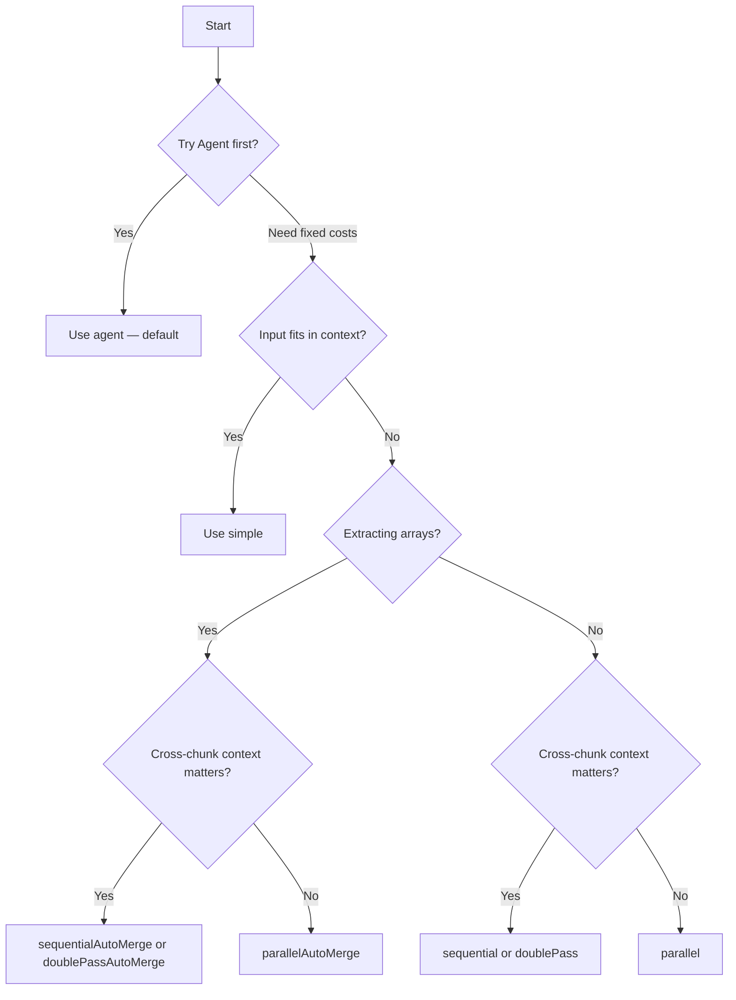

import { TypeTable } from 'fumadocs-ui/components/type-table';
import { Callout } from 'fumadocs-ui/components/callout';
import { Card, Cards } from 'fumadocs-ui/components/card';
import { Tabs, Tab } from 'fumadocs-ui/components/tabs';

The **Agent** strategy is the default and recommended way to use Struktur. It gives the LLM a virtual filesystem and lets it autonomously decide how to extract your data.

For documents where you need more control, Struktur also provides alternative strategies that use fixed chunking and parallelism patterns.

## Strategy comparison

| Strategy | Speed | Context | Arrays | Token Cost | Best For |
|----------|-------|---------|--------|-----------|----------|
| `agent` (default) | Adaptive | Adaptive | Automatic | Varies | **Most documents** |
| `simple` | Fastest | Full | — | Lowest | Small inputs |
| `parallel` | Fast | None | LLM merge | Medium | Speed priority |
| `sequential` | Medium | Full | Context | Medium | Context-dependent |
| `parallelAutoMerge` | Fast | None | Auto + dedupe | Medium | Large arrays |
| `sequentialAutoMerge` | Medium | Full | Auto + dedupe | Medium | Ordered arrays |
| `doublePass` | Slow | Full | LLM merge | High | Maximum quality |
| `doublePassAutoMerge` | Slow | Full | Auto + dedupe | High | Quality + arrays |

---

## Agent (Default)

<Callout type="info">
  **The Agent strategy is the default.** You don't need to specify `--strategy agent` — it's used automatically when you run `struktur extract`.
</Callout>

Autonomous extraction using a virtual filesystem. The agent decides when to read files, search for patterns, and build output incrementally.

<Cards>
  <Card title="Best For" description="Most documents — adapts automatically" />
  <Card title="Virtual FS" description="read, grep, find, ls, bash" />
  <Card title="Output Tools" description="set_output_data, update_output_data" />
  <Card title="Model Requirement" description="Must support tool calling" />
</Cards>

### How it works

1. **Document loaded** into virtual filesystem (`/artifacts/artifact.json`, `/artifacts/manifest.json`, `/artifacts/images/`)
2. **Agent explores** using tools: read files, grep for patterns, list directories, execute commands
3. **Incremental extraction** — calls `set_output_data` when first data found, `update_output_data` as more discovered
4. **Validation** — schema validation on every output update, with automatic retry on errors
5. **Completion** — agent calls `finish` when done, or `fail` if extraction impossible

The agent adapts to your document:
- **Small documents** — reads everything at once
- **Large documents** — navigates systematically, searching for relevant sections
- **Complex schemas** — builds output incrementally, validating as it goes

### Configuration

<TypeTable
  type={{
    model: {
      description: 'Full model spec, e.g. `openrouter/deepseek/deepseek-v4.1-flash`. Alternative to passing provider and modelId separately.',
      type: 'string | AiSdkModel',
      required: false,
    },
    provider: {
      description: 'Provider name (e.g., anthropic, openai). Required unless `model` is given.',
      type: 'string',
      required: false,
    },
    modelId: {
      description: 'Model identifier (e.g., claude-sonnet-4, gpt-4o). Required unless `model` is given.',
      type: 'string',
      required: false,
    },
    maxSteps: {
      description: 'Maximum agent steps/turns',
      type: 'number',
      default: '50',
      required: false,
    },
    maxIterations: {
      description: 'Number of iteration loops. Each loop allows up to maxSteps steps, so the total step budget is maxIterations x maxSteps.',
      type: 'number',
      default: '1',
      required: false,
    },
    maxValidationAttempts: {
      description:
        'Maximum schema-validation repair rounds before the run fails with a `SchemaValidationError`. Values are validated on every tool call regardless; this caps how many times `finish()` may be rejected before giving up.',
      type: 'number',
      default: '3',
      required: false,
    },
    stepTimeoutMs: {
      description: 'Maximum time per LLM step before it times out',
      type: 'number',
      default: '300000 (5 min)',
      required: false,
    },
    vision: {
      description: 'Enable image tools (`view_image`). Auto-detected from the model catalogue by default; set explicitly to override the detection.',
      type: 'boolean',
      default: 'detected',
      required: false,
    },
    reasoningEffort: {
      description: 'Reasoning effort for models that support it',
      type: '"low" | "medium" | "high"',
      required: false,
    },
    outputInstructions: {
      description: 'Additional extraction guidance',
      type: 'string',
      required: false,
    },
    systemPrompt: {
      description: 'Override default system prompt',
      type: 'string',
      required: false,
    },
    prefill: {
      description:
        'Pre-load document context as synthetic read/view_image tool calls before the first step. `textTokens` caps the text, `maxImages` (default 1) and `maxImageBytes` (default 12 MB) cap images.',
      type: '{ textTokens: number; maxImages?: number; maxImageBytes?: number }',
      required: false,
    },
  }}
/>

#### Context prefill

The agent normally spends its first steps reading `/artifact.json` and looking at the image overview. Prefill hands it that context up front so it can extract immediately:

```ts
import { extract, agent } from "@struktur/sdk";

const result = await extract({
  artifacts,
  schema,
  strategy: agent({
    provider: "openrouter",
    modelId: "deepseek/deepseek-v4.1-flash",
    prefill: { textTokens: 300_000, maxImages: 4 },
  }),
});
```

The block is deterministic — stable tool-call ids, no timestamps — so the same document always produces the same prefix and providers can prompt-cache it. Images get far less budget than text because a single page image is 1–4 MB of base64; the defaults load the image overview only.

### Example

<Tabs items={['CLI', 'SDK']}>
  <Tab value="CLI">
```bash
# Agent is the default — no --strategy needed
struktur extract --input ./document.pdf \
  --schema ./schema.json \
  --model anthropic/claude-sonnet-4

# With max steps limit
struktur extract --input ./document.pdf \
  --schema ./schema.json \
  --model anthropic/claude-sonnet-4 \
  --max-steps 30
```
  </Tab>
  <Tab value="SDK">
```ts
import { extract, agent } from "@struktur/sdk";

const result = await extract({
  artifacts,
  schema,
  strategy: agent({
    provider: "anthropic",
    modelId: "claude-sonnet-4",
    maxSteps: 50,
  }),
});
```
  </Tab>
</Tabs>

### When to use

- **Always try agent first** — it's the default for a reason
- Works well for most document types and sizes
- Automatically adapts to document structure
- Best for complex schemas with nested objects

### Model requirements

The agent imposes two hard requirements that the other strategies do not:

| Requirement | Needed for | Why |
| ----------- | ---------- | --- |
| **Tool / function calling** | Every agent run | The agent's whole loop is tool calls. A model without it cannot run the strategy at all. |
| **Image input** | `--images`, `--screenshots` | Without it `view_image` is disabled, so the model never sees content that lives only in images. |

Both are hard requirements, but only one is checked for you: the agent queries the provider's model catalogue for the input modalities a model accepts, and reports the result via `onVisionStatus`. Tool/function-calling support is **not** detected — a model without it fails at the provider when the first tool call is sent. Check what a provider currently offers before choosing:

```bash
struktur config models list --provider openrouter
```

<Callout type="warn">
  Some models advertise tool support but call tools unreliably, or reject tool-use requests outright. That surfaces as a confusing provider error rather than a clean "unsupported" message — if a run dies on a tool-use error, switch models.
</Callout>

### Speed and cost

Wall-clock time often differs more between *deployments of the same model* than between different models. On OpenRouter, append `:nitro` to route to the fastest available provider:

```bash
--model "openrouter/deepseek/deepseek-v4.1-flash:nitro"
```

On our real-estate exposé corpus this roughly halved median extraction time for a high-volume model (~81s to ~42s), but the gain depends on how loaded the default provider is — measure on your own documents rather than assuming it. `:floor` is the cheapest-provider counterpart.

Reasoning models trade latency for thinking budget. `--reasoning-effort low` is usually enough for structured extraction, and is what Struktur's own configuration uses.

<Callout type="info">
  Model availability and pricing change constantly, so this page deliberately does not pin a recommendation list. Pick a candidate from `struktur config models list`, confirm it does tool calling (and vision, if you need images), then compare it on your own documents.
</Callout>

### Virtual filesystem

The agent has access to a virtual filesystem containing:

- `/artifacts/artifact.json` — All artifacts in JSON format (images replaced by virtual paths)
- `/artifacts/manifest.json` — Summary and metadata
- `/artifacts/images/` — Extracted image files (when artifacts have embedded images), including the generated image overview

The agent can:
- **Read** files with pagination (`offset`, `limit`)
- **Grep** for patterns
- **Find** files by name
- **List** directories
- **View images** by virtual path with `view_image` (only when the model accepts image input)
- **Bash** execute commands (on virtual filesystem only)

Every extracted image carries a `virtualPath`. The image overview is a labelled contact sheet of all of them, built at parse time, so the agent can see the whole document's visual content in one image and then open only the images that matter. See [Image Overview](/docs/explanation/document-parsing#image-overview).

### Output management

Special tools for building extraction output:

- **`set_output_data(data)`** — Set initial output (first time data is found)
- **`update_output_data(changes)`** — Merge changes into existing output
- **`finish()`** — Complete extraction (only works if data validates)
- **`fail(reason)`** — Mark extraction as impossible

The agent is encouraged to update output continuously as it explores, not wait until the end.

---

## Simple

Single-shot extraction for small inputs. Use when the agent is overkill for tiny documents.

<Cards>
  <Card title="LLM Calls" description="1" />
  <Card title="Parallelism" description="None" />
  <Card title="Best for" description="Small, single-chunk inputs" />
</Cards>

### Configuration

<TypeTable
  type={{
    model: {
      description: 'Model instance from @ai-sdk/*',
      type: 'LanguageModel',
      required: true,
    },
    outputInstructions: {
      description: 'Extra instructions for the model',
      type: 'string',
      required: false,
    },
    strict: {
      description: 'Always true for simple (single-shot, no intermediate steps)',
      type: 'boolean',
      default: 'true',
      required: false,
    },
  }}
/>

### Algorithm

1. Build extraction prompt from artifacts + schema
2. Send to LLM
3. Validate output against the schema
4. Retry on validation failure (up to 3 attempts)
5. Return validated output

### Example

<Tabs items={['CLI', 'SDK']}>
  <Tab value="CLI">
```bash
struktur extract --input document.txt --schema schema.json --strategy simple
```
  </Tab>
  <Tab value="SDK">
```js
import { extract, simple } from "@struktur/sdk";
import { openai } from "@ai-sdk/openai";

const result = await extract({
  artifacts,
  schema,
  strategy: simple({
    model: openai("gpt-4o-mini"),
  }),
});
```
  </Tab>
</Tabs>

### When to use

- Document fits within the model's context window (~10k tokens)
- Simple schema without nested arrays
- Testing or prototyping
- Speed is the priority
- When you want predictable token costs (agent costs vary by document)

---

## Parallel

Concurrent batch processing with LLM merge.

<Cards>
  <Card title="LLM Calls" description="N batches + 1 merge" />
  <Card title="Parallelism" description="Full" />
  <Card title="Best for" description="Large inputs, speed priority" />
</Cards>

### Configuration

<TypeTable
  type={{
    model: {
      description: 'Model for extraction',
      type: 'LanguageModel',
      required: true,
    },
    mergeModel: {
      description: 'Model for merging partial results',
      type: 'LanguageModel',
      required: true,
    },
    chunkSize: {
      description: 'Token budget per batch',
      type: 'number',
      required: true,
    },
    concurrency: {
      description: 'Max parallel batches',
      type: 'number',
      default: 'All batches',
      required: false,
    },
    maxImages: {
      description: 'Max images per batch',
      type: 'number',
      default: 'Unlimited',
      required: false,
    },
    outputInstructions: {
      description: 'Extra instructions',
      type: 'string',
      required: false,
    },
    strict: {
      description: 'Validate required fields on every step',
      type: 'boolean',
      default: 'false',
      required: false,
    },
  }}
/>

### Algorithm

1. Split artifacts into batches (respecting `chunkSize` and `maxImages`)
2. Extract from each batch concurrently
3. Validate each batch output with retry
4. Send all partial results to `mergeModel` for LLM merge
5. Validate merged output
6. Return final result

### Example

<Tabs items={['CLI', 'SDK']}>
  <Tab value="CLI">
```bash
struktur extract --input large.pdf --schema schema.json --strategy parallel --model openai/gpt-4o-mini
```
  </Tab>
  <Tab value="SDK">
```js
import { extract, parallel } from "@struktur/sdk";
import { openai } from "@ai-sdk/openai";

const result = await extract({
  artifacts,
  schema,
  strategy: parallel({
    model: openai("gpt-4o-mini"),
    mergeModel: openai("gpt-4o-mini"),
    chunkSize: 10000,
    concurrency: 3,
  }),
});
```
  </Tab>
</Tabs>

### When to use

- Speed is the top priority
- Chunks are relatively independent
- Many documents to process
- Can accept potential loss of cross-chunk context
- When agent costs are too high for your use case

---

## Sequential

Process chunks in order with context preservation.

<Cards>
  <Card title="LLM Calls" description="N batches" />
  <Card title="Parallelism" description="None" />
  <Card title="Best for" description="Context-dependent documents" />
</Cards>

### Configuration

<TypeTable
  type={{
    model: {
      description: 'Model for extraction',
      type: 'LanguageModel',
      required: true,
    },
    chunkSize: {
      description: 'Token budget per batch',
      type: 'number',
      required: true,
    },
    maxImages: {
      description: 'Max images per batch',
      type: 'number',
      default: 'Unlimited',
      required: false,
    },
    outputInstructions: {
      description: 'Extra instructions',
      type: 'string',
      required: false,
    },
    strict: {
      description: 'Validate required fields on every step',
      type: 'boolean',
      default: 'false',
      required: false,
    },
  }}
/>

### Algorithm

1. Split artifacts into batches
2. For each batch in order:
   - Build prompt including previous extraction result as context
   - Extract from batch
   - Validate with retry
   - Store result for next iteration
3. Return final result

### Example

<Tabs items={['CLI', 'SDK']}>
  <Tab value="CLI">
```bash
struktur extract --input report.pdf --schema schema.json --strategy sequential --model openai/gpt-4o-mini
```
  </Tab>
  <Tab value="SDK">
```js
import { extract, sequential } from "@struktur/sdk";
import { openai } from "@ai-sdk/openai";

const result = await extract({
  artifacts,
  schema,
  strategy: sequential({
    model: openai("gpt-4o-mini"),
    chunkSize: 10000,
  }),
});
```
  </Tab>
</Tabs>

### When to use

- Context between chunks matters
- Building data incrementally (e.g., accumulating line items)
- Later sections reference earlier sections
- Need better accuracy than parallel
- Agent is making too many tool calls for your document structure

---

## Auto-Merge Strategies

<Callout type="info">
  Strategies with "AutoMerge" in the name use schema-aware merge and deduplication. They're ideal for extracting arrays that may have duplicates across chunks.
</Callout>

### parallelAutoMerge

Parallel extraction with schema-aware merge and deduplication.

**Best for:** Array extraction from large inputs where speed matters.

### sequentialAutoMerge

Sequential extraction with schema-aware merge and deduplication.

**Best for:** Ordered array extraction where context matters.

### doublePassAutoMerge

Double-pass extraction with schema-aware merge and deduplication.

**Best for:** Large array extraction with maximum quality requirement.

---

## Choosing a Strategy

**Start with the Agent.** It's the default because it works best for most documents.

| Strategy | When to use |
|---|---|
| `agent` (default) | **Start here** — autonomous exploration for most documents |
| `simple` | Small input, fits in one context window, predictable costs |
| `parallel` | Large input, order doesn't matter, speed priority |
| `sequential` | Large input, context carries across chunks |
| `parallelAutoMerge` | Large input with arrays — parallel + dedup |
| `sequentialAutoMerge` | Large input with arrays — sequential + dedup |
| `doublePass` | Quality matters, two-pass refinement |
| `doublePassAutoMerge` | Quality + arrays + dedup |

### Quick decision flowchart



---

## See also

- [The Extraction Pipeline](/docs/explanation/pipeline) — where strategies fit
- [Chunking & Token Budgets](/docs/explanation/chunking) — how batches are formed
- [Validation & Retries](/docs/explanation/validation) — the retry loop
