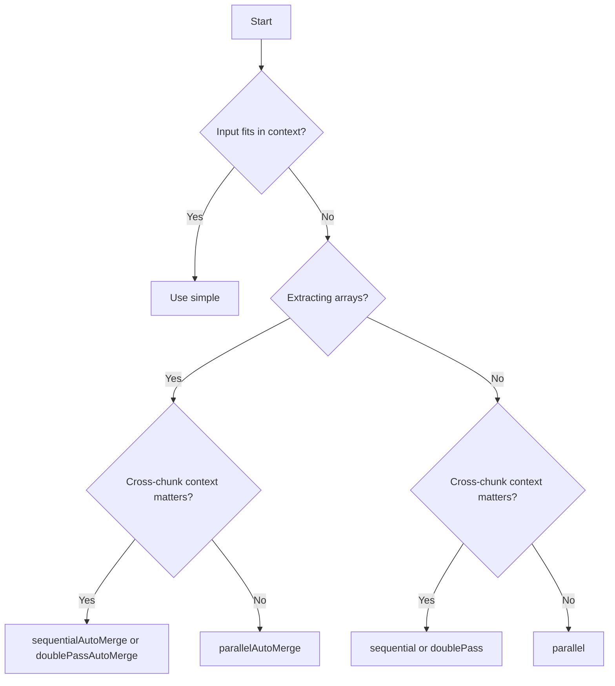

import { TypeTable } from 'fumadocs-ui/components/type-table';
import { Callout } from 'fumadocs-ui/components/callout';
import { Card, Cards } from 'fumadocs-ui/components/card';
import { Tabs, Tab } from 'fumadocs-ui/components/tabs';

A strategy is the orchestration engine. It decides how to split the input, how many LLM calls to make, whether to run them concurrently or sequentially, and how to combine results.

## Strategy comparison

| Strategy | Speed | Context | Arrays | Token Cost |
|----------|-------|---------|--------|-----------|
| `simple` | Fastest | Full | — | Lowest |
| `parallel` | Fast | None | LLM merge | Medium |
| `sequential` | Medium | Full | Context | Medium |
| `parallelAutoMerge` | Fast | None | Auto + dedupe | Medium |
| `sequentialAutoMerge` | Medium | Full | Auto + dedupe | Medium |
| `doublePass` | Slow | Full | LLM merge | High |
| `doublePassAutoMerge` | Slow | Full | Auto + dedupe | High |

---

## Simple

Single-shot extraction for small inputs.

<Cards>
  <Card title="LLM Calls" description="1" />
  <Card title="Parallelism" description="None" />
  <Card title="Best for" description="Small, single-chunk inputs" />
</Cards>

### Configuration

<TypeTable
  type={{
    model: {
      description: 'Model instance from @ai-sdk/*',
      type: 'LanguageModel',
      required: true,
    },
    outputInstructions: {
      description: 'Extra instructions for the model',
      type: 'string',
      required: false,
    },
    strict: {
      description: 'Always true for simple (single-shot, no intermediate steps)',
      type: 'boolean',
      default: 'true',
      required: false,
    },
  }}
/>

### Algorithm

1. Build extraction prompt from artifacts + schema
2. Send to LLM
3. Validate output against the schema
4. Retry on validation failure (up to 3 attempts)
5. Return validated output

### Example

<Tabs items={['SDK', 'CLI']}>
  <Tab value="SDK">
```js
import { extract, simple } from "@struktur/sdk";
import { openai } from "@ai-sdk/openai";

const result = await extract({
  artifacts,
  schema,
  strategy: simple({
    model: openai("gpt-4o-mini"),
  }),
});
```
  </Tab>
  <Tab value="CLI">
```bash
struktur --input document.txt --schema schema.json --model openai/gpt-4o-mini
# --strategy simple is the default
```
  </Tab>
</Tabs>

### When to use

- Document fits within the model's context window (~10k tokens)
- Simple schema without nested arrays
- Testing or prototyping
- Speed is the priority

---

## Parallel

Concurrent batch processing with LLM merge.

<Cards>
  <Card title="LLM Calls" description="N batches + 1 merge" />
  <Card title="Parallelism" description="Full" />
  <Card title="Best for" description="Large inputs, speed priority" />
</Cards>

### Configuration

<TypeTable
  type={{
    model: {
      description: 'Model for extraction',
      type: 'LanguageModel',
      required: true,
    },
    mergeModel: {
      description: 'Model for merging partial results',
      type: 'LanguageModel',
      required: true,
    },
    chunkSize: {
      description: 'Token budget per batch',
      type: 'number',
      required: true,
    },
    concurrency: {
      description: 'Max parallel batches',
      type: 'number',
      default: 'All batches',
      required: false,
    },
    maxImages: {
      description: 'Max images per batch',
      type: 'number',
      default: 'Unlimited',
      required: false,
    },
    outputInstructions: {
      description: 'Extra instructions',
      type: 'string',
      required: false,
    },
    strict: {
      description: 'Validate required fields on every step',
      type: 'boolean',
      default: 'false',
      required: false,
    },
  }}
/>

### Algorithm

1. Split artifacts into batches (respecting `chunkSize` and `maxImages`)
2. Extract from each batch concurrently
3. Validate each batch output with retry
4. Send all partial results to `mergeModel` for LLM merge
5. Validate merged output
6. Return final result

### Example

<Tabs items={['SDK', 'CLI']}>
  <Tab value="SDK">
```js
import { extract, parallel } from "@struktur/sdk";
import { openai } from "@ai-sdk/openai";

const result = await extract({
  artifacts,
  schema,
  strategy: parallel({
    model: openai("gpt-4o-mini"),
    mergeModel: openai("gpt-4o-mini"),
    chunkSize: 10000,
    concurrency: 3,
  }),
});
```
  </Tab>
  <Tab value="CLI">
```bash
struktur --input large.pdf --schema schema.json --strategy parallel --model openai/gpt-4o-mini
```
  </Tab>
</Tabs>

### When to use

- Speed is the top priority
- Chunks are relatively independent
- Many documents to process
- Can accept potential loss of cross-chunk context

---

## Sequential

Process chunks in order with context preservation.

<Cards>
  <Card title="LLM Calls" description="N batches" />
  <Card title="Parallelism" description="None" />
  <Card title="Best for" description="Context-dependent documents" />
</Cards>

### Configuration

<TypeTable
  type={{
    model: {
      description: 'Model for extraction',
      type: 'LanguageModel',
      required: true,
    },
    chunkSize: {
      description: 'Token budget per batch',
      type: 'number',
      required: true,
    },
    maxImages: {
      description: 'Max images per batch',
      type: 'number',
      default: 'Unlimited',
      required: false,
    },
    outputInstructions: {
      description: 'Extra instructions',
      type: 'string',
      required: false,
    },
    strict: {
      description: 'Validate required fields on every step',
      type: 'boolean',
      default: 'false',
      required: false,
    },
  }}
/>

### Algorithm

1. Split artifacts into batches
2. For each batch in order:
   - Build prompt including previous extraction result as context
   - Extract from batch
   - Validate with retry
   - Store result for next iteration
3. Return final result

### Example

<Tabs items={['SDK', 'CLI']}>
  <Tab value="SDK">
```js
import { extract, sequential } from "@struktur/sdk";
import { openai } from "@ai-sdk/openai";

const result = await extract({
  artifacts,
  schema,
  strategy: sequential({
    model: openai("gpt-4o-mini"),
    chunkSize: 10000,
  }),
});
```
  </Tab>
  <Tab value="CLI">
```bash
struktur --input report.pdf --schema schema.json --strategy sequential --model openai/gpt-4o-mini
```
  </Tab>
</Tabs>

### When to use

- Context between chunks matters
- Building data incrementally (e.g., accumulating line items)
- Later sections reference earlier sections
- Need better accuracy than parallel

---

## Auto-Merge Strategies

<Callout type="info">
  Strategies with "AutoMerge" in the name use schema-aware merge and deduplication. They're ideal for extracting arrays that may have duplicates across chunks.
</Callout>

### parallelAutoMerge

Parallel extraction with schema-aware merge and deduplication.

**Best for:** Array extraction from large inputs where speed matters.

### sequentialAutoMerge

Sequential extraction with schema-aware merge and deduplication.

**Best for:** Ordered array extraction where context matters.

### doublePassAutoMerge

Double-pass extraction with schema-aware merge and deduplication.

**Best for:** Large array extraction with maximum quality requirement.

---

## Choosing a Strategy

Pick based on input size and whether you're extracting arrays:

| Strategy | When to use |
|---|---|
| `simple` | Small input, fits in one context window |
| `parallel` | Large input, order doesn't matter, scalar fields |
| `sequential` | Large input, context carries across chunks |
| `parallelAutoMerge` | Large input with arrays — parallel + dedup |
| `sequentialAutoMerge` | Large input with arrays — sequential + dedup |
| `doublePass` | Quality matters, two-pass refinement |
| `doublePassAutoMerge` | Quality + arrays + dedup |

### Quick decision flowchart



---

## See also

- [The Extraction Pipeline](/docs/explanation/pipeline) — where strategies fit
- [Chunking & Token Budgets](/docs/explanation/chunking) — how batches are formed
- [Validation & Retries](/docs/explanation/validation) — the retry loop
